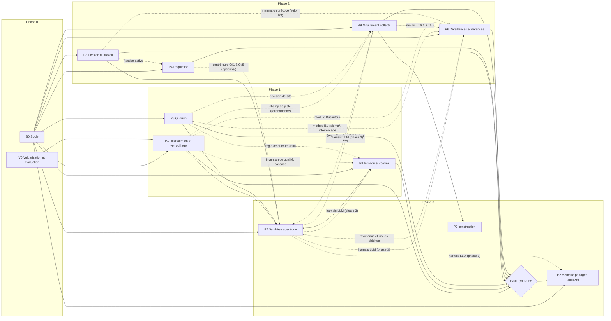

# Architecture du programme

**Statut :** document de programme, conforme à [00-cadre.md](00-cadre.md), qui prime; toute tension avec le cadre est listée en fin de document. **Date :** 2026-10-01. **Régime :** production : le chercheur agit sur ce document pour ordonner le programme, fixer les propriétaires des cibles et arbitrer les écarts entre fiches.
**Fondé sur :** les dix fiches de [projets/](../projets/) (S0, P1 à P9), écrites avant ce document et comparées entre elles; [04-protocole-reproduction.md](04-protocole-reproduction.md), [05-spec-simulation.md](05-spec-simulation.md) et [06-metriques-et-typologie.md](06-metriques-et-typologie.md); [07-vulgarisation-evaluation.md](07-vulgarisation-evaluation.md) pour V0 (publics, budget d'heures, portes); l'audit [lacunes](annexes/audit/lacunes.md) et la [proposition v3](annexes/proposition-v3.md) pour la correspondance v3 → v4. Aucune source n'est modifiée. Ce document ne relit aucune source scientifique : il reprend ce que disent les fiches et relève où elles divergent.

**Lecture.**
- **Marques de lecture** de la matrice : celles des dossiers, reprises par chaque fiche. [T] texte intégral; [T*] page lue par outil, non recoupée; [R] résumé; [M] métadonnées; [S] source secondaire; [I] inférence ou calcul; [à confirmer]; [non vérifiée].
- **État [I]** (matrice) : classement de ce document d'après le texte de la fiche. *prête* : aucun blocage de lecture signalé; *provisoire* : valeur [à confirmer], source [R] ou [S], reconstruction ou critère provisoire (au mieux « satisfaite sous réserve », protocole de reproduction); *bloquée* : la fiche interdit le code avant lecture; *garde-fou* : empirique à petit effectif, non bloquant; *différée*, *transférée*, *sans objet* : comme la fiche le dit. La fiche prévaut en cas d'écart.
- **Efforts** : ceux des fiches, tous [estimation, à confirmer]. Les totaux sont des calculs [I] de ce document.
- Aucun énoncé de ce document n'est une transposition fourmi-abeille-agent : il n'y a donc pas de statut épistémique à porter. Chaque énoncé d'architecture renvoie à sa source (cadre, fiche, document) ou porte [I].

---

## 1. Vue d'ensemble

Le programme étudie la coordination sans contrôle central chez la fourmilière **et** la ruche, au même titre, aux niveaux individuel et collectif, pour en tirer un parallèle rigoureux avec les systèmes d'agents (cadre, intention). Il se compose :

- d'un **socle S0** (typologie, vecteur R, gain G, noyau de simulation, harnais) qui n'étudie aucune espèce et rend les questions testables;
- d'un **volet transversal V0** (pages à trois niveaux, charte, évaluation pédagogique);
- de **neuf projets** (P1 à P9), dont P2 est une annexe soumise à go/no-go;
- de **quatre phases** (0 à 3). Le numéro d'un projet n'est pas son rang d'exécution (décision D5).

Chaque fiche livre : des cibles de reproduction (réplication avant extension), des hypothèses directionnelles, des expériences originales étiquetées confirmatoires ou exploratoires, un parallèle agentique avec témoin orchestré et un catalogue de pages. Les dix fiches définissent **95 hypothèses, 190 cibles de reproduction, 74 expériences originales et 155 risques** [I, calcul : décompte des identifiants de chaque fiche, recoupé par script].

### Tableau des projets (conforme au cadre, enrichi des fiches)

| ID | Projet (fiche) | Rôle | Phase | Dépendances du cadre | Taxons nommés par la fiche | Effort de la fiche (sem.-pers.) [estimation, à confirmer] | H / T / E |
|---|---|---|---|---|---|---|---|
| S0 | [Socle](../projets/S0-socle.md) : typologie, R et G, noyau, harnais, spike | Prérequis de tous; porte de sortie go, go conditionnel ou no-go avant P1 | 0 | aucune | étalons M1c (*Apis mellifera*) et M6 (*Temnothorax*) | 12 | 5 / 36 / 8 |
| V0 | Vulgarisation et évaluation ([07-vulgarisation-evaluation.md](07-vulgarisation-evaluation.md)) | Gabarit, charte, évaluation; transversal | 0, puis continu | gabarit avant P1 | sans objet | hors budget fixe; 1 792 à 3 240 h pour 80 pages de huit parcours [estimation de V0, à confirmer] | HV0, TV0, EV0 (propres à V0) |
| P1 | [Recrutement et verrouillage](../projets/P1-recrutement-verrouillage.md) | Piste contre danse; manipulations appariées; leviers du canal | 1 | S0; gabarit de V0 | *Linepithema humile*, *Pheidole megacephala*, *Lasius niger*; *Apis mellifera*; témoin Meliponini | 28,5 | 9 / 9 / 7 |
| P8 | [Individu et colonie](../projets/P8-individu-et-colonie.md) *(nouveau)* | Intelligence individuelle contre collective; théorie du vote; G en agrégation et interaction | 1 | S0 | *Temnothorax rugatulus*, *Lasius niger*; *Apis mellifera* | 20 (hors P7) | 9 / 16 / 5 |
| P5 | [Décision par quorum](../projets/P5-decision-par-quorum.md) | Vitesse, justesse, inhibition; interblocage distinct de la scission | 1 | S0 | *Temnothorax albipennis*, *T. curvispinosus*; *Apis mellifera* | 27 | 9 / 24 / 6 |
| P3 | [Division du travail](../projets/P3-division-du-travail.md) | Seuils, castes, polyéthisme, diversité | 2 | S0 | *Pheidole*, *T. rugatulus*, *Myrmica kotokui*, *Bombus terrestris* (contre-modèle); *Apis mellifera*; modèle générique de la guêpe *Polistes dominulus* | 21 | 9 / 14 / 9 |
| P4 | [Régulation sans vue d'ensemble](../projets/P4-regulation-sans-vue-densemble.md) | Débit, délai, backpressure | 2 | S0 | *Pogonomyrmex barbatus*; *Apis mellifera* | 23 | 7 / 12 / 8 |
| P6 | [Défaillances et défenses](../projets/P6-defaillances-et-defenses.md) | Verrouillage, interblocage, parasites, injection; taxonomie des échecs | 2 | S0 | *Monomorium pharaonis*, *P. megacephala*, *Eciton*; *Apis mellifera* | 25 à 34,5 | 10 / 14 / 9 |
| P9 | [Mouvement collectif et construction](../projets/P9-mouvement-collectif-et-construction.md) *(nouveau)* | Moulin, transport, minorité informée, auto-assemblage, stigmergie constructive | 2 (construction : 3) | S0 | *Eciton*, *L. niger*, *Atta cephalotes*, *Paratrechina longicornis*, *Solenopsis invicta*; *Apis mellifera* | 34 en phase 2, plus 5 en phase 3 | 20 / 33 / 6 |
| P7 | [Synthèse agentique](../projets/P7-synthese-agentique.md) | Fourmi, abeille, agent LLM; témoin orchestré; harnais LLM | 3 | résultats reproduits de P1, P3, P5, P8; typologie de S0 | *L. humile*, *Pheidole*, *T. albipennis*; *Apis mellifera* | 34 | 11 / 20 / 12 |
| P2 | [Mémoire partagée et métaheuristiques](../projets/P2-memoire-partagee-metaheuristiques.md) *(annexe, go/no-go)* | ACO, ABC, allocation dynamique | 3 | phases 1 et 2 achevées (porte G0 de la fiche) | aucun résultat biologique reproduit | 23, dont 18 pour le noyau | 6 / 12 / 4 |

**Totaux d'effort** [I, calcul d'après les fiches; estimation, à confirmer] : 252,5 à 262 semaines-personne, hors V0, répartis ainsi : phase 0, 12; phase 1, 75,5; phase 2, 103 à 112,5; phase 3, 62 (dont 5 pour la construction de P9 et 23 pour P2). La plage vient du seul P6 (25 à 34,5). Deux postes ne sont comptés par aucune fiche : l'exécution de E8.5 et de T8.11 à T8.13, et le coût fixe de V0 (IC13).

---

## 2. Graphe des dépendances

Traits pleins : dépendances du cadre. Traits pointillés : dépendances déclarées par les fiches et absentes du cadre (détail et écarts dans le tableau qui suit; arbitrage dans IC4).

| Relation | Déclarée par | Au cadre | Remarque |
|---|---|---|---|
| S0 → tous | cadre; chaque fiche | oui | S0 précède tout; porte de sortie avant tout code de P1 |
| V0 → P1 (gabarit) | cadre; S0, P1 | oui | frontière du gabarit entre S0 et V0 : D17 |
| P1, P3, P5, P8 → P7 | cadre; P7 | oui | P7 exige au minimum T1.1, T1.2, T1.4 (P1) et T8.10 avant T7.6 (P8); P3 est de phase 2 |
| phases 1 et 2 → P2 | cadre; P2 | oui | P2 : périmètres emboîtés (noyau, agentique, allocation) |
| P1 → P8 | P8 (E8.3 réutilise le protocole d'inversion de qualité) | non | P1 la déclare comme sortante (modèle d'Okada partagé) |
| P5 → P8 | P5, P8 (forme de Hill de la règle de quorum) | non | intra-phase 1 |
| P5 → P6 | P5, P6 (module B1) | non | P6 attend la porte A de P5 |
| P9 → P6 | P6 (T6.5, T6.3, T6.4 prérequis de E6.1) | non | intra-phase 2; P9 ne la déclare que comme « s'il les reprend » |
| P1 → P6 | P6 (module de Dussutour), P1 | non | recoupement de cible : IC2 |
| P3 → P6 | P3 seulement | non | P6 ne la reprend pas : IC12 |
| P3 → P4 | P3 (fraction active δ/α) | non | P4 : coordination sur H4.6 seulement |
| P1, P5 → P9 | P9 (recommandées) | non | piste et fonction de choix; décision de site avant guidage |
| P4, P6, P9 ⇢ P7 | P4 (optionnel), P6, P9 | non | le cadre ne fait dépendre P7 d'aucun des trois; P7 ne reprend de P9 que E7.8 : IC11 |
| P7 ⇢ P6, P8, P9, P2 | P6, P8, P9 (volets LLM), P2 (porte G2) | non | inversion de phase pour P6, P8 et P9 : IC4 |
| P4 ← P1 | audit lacunes (L24) | non | la fiche P4 se dit indépendante de P1, P5 et P8 tout en tirant des paramètres de Seeley et al. 1991 (risque R48 de P4) : IC25 |

---

## 3. Correspondance v3 → v4

Ce qui est resté, a bougé, a été ajouté ou recadré. Sources : cadre (sections « Ce que l'audit a changé » et « Architecture du programme »), fiches, audit [lacunes](annexes/audit/lacunes.md) (identifiants `L<n>`).

| Objet de la v3 | En v4 | Nature | Source |
|---|---|---|---|
| Thèse « la reine ne commande pas » | Thèse reformulée : décisions de travail et de déplacement émergentes, sans contrôle central à l'exécution; « la reine ne commande pas » reste un constat biologique borné, jamais une prescription d'architecture; encart « Ce que fait vraiment la reine » | recadré | cadre; audit L14 |
| « Chorégraphie » (un seul mot) | Typologie à trois axes (plan global, contrôle central, médium), quatre régimes, règle de classement des hybrides; le « problème inverse » devient une question de P7 | recadré | cadre; [06-metriques-et-typologie.md](06-metriques-et-typologie.md) |
| Un seul moteur, deux espèces interchangeables | Trois couches : noyau commun, un modèle de référence par article, modèle chorégraphique commun à canal interchangeable | recadré | cadre; D1 |
| « La fourmi » et « l'abeille » | Taxons nommés avec préréglage; le canal (piste, danse) est une variable du modèle | recadré | cadre; audit L02, L16 |
| Question transversale « scalaire, symbole, langage » | QR0 à QR4; R vecteur à cinq composantes; G à budget égal avec trois références et décomposition agrégation-interaction | recadré | cadre; audit L03 |
| P1 : piste contre danse | Conservé et enrichi : leviers du canal (persistance, non-linéarité, rétroaction négative, bruit, taille), encombrement, bruit bénéfique, erreur de danse, inversion de qualité appariée; le test de la valeur de la danse selon l'habitat passe à P8 | enrichi, en partie déplacé | P1; audit L06 à L09, L26 |
| P2 : ACO contre ABC | Recentré en annexe de phase 3 soumise à go/no-go; « piste = chemin, danse = lieu » remplacé par la granularité de la mémoire partagée; cibles purement algorithmiques; critique de Sörensen appliquée | recentré | cadre; P2; audit L17 |
| P3 : division du travail | Corrigé (ce sont les majors qui prennent le relais); « une ruche homogène oscille » et « des agents identiques oscillent » deviennent des hypothèses; réserve de main-d'œuvre ajoutée; passe de la deuxième place du parcours v3 à la phase 2, après P1, P8 et P5 | corrigé, enrichi, reporté | cadre (corrections 1, 13); P3; audit L15, L25 |
| P4 : régulation | TCP et loi de Little corrigés (analogie absente de l'article; Little déjà publié); « deux files » au lieu de « deux lectures de la même file »; boucle fermée de [Pagliara et al. 2018] et file d'appariement de [Anderson et Ratnieks 1999a] ajoutées | corrigé, enrichi | cadre (corrections 5, 6); P4 |
| P5 : quorum | Reste en tête du parcours (phase 1, avec P1 et P8); signal d'arrêt = inhibition, pas veto; interblocage distinct de la scission; chaîne décision-action | corrigé, enrichi | cadre (corrections 7, 8); P5; audit L13, L22 |
| P6 : pathologies | Le moulin passe à P9 (modèle de Couzin et Franks 2003; Couzin et al. 2002 en contrepoint); taxonomie propre en trois couches; volet de défenses; périmètre défensif et lien méthodologique avec les bancs EscapeBench et LeakLab | recentré, en partie déplacé | cadre (correction 2); P6; audit L18 |
| P7 : synthèse agentique | « Seul projet sans résultat publié » devenu inexact : ancrages reproduits d'abord; grille 2 × 4 recomptée en plan fractionnaire; témoin orchestré; phase 3 | recadré | cadre (correction 12); P7 |
| *(absent)* | **P8** Individu et colonie | ajouté | audit L01 (critique) |
| *(absent)* | **P9** Mouvement collectif et construction | ajouté | audit L10, L11 |
| *(absent)* | **S0** Socle et **V0** Vulgarisation et évaluation | ajoutés | cadre; audit L03 (S0); audit [vulgarisation](annexes/audit/vulgarisation.md) (V0) |
| Parcours « 1, 3, 5, puis 2, 4, 6, puis 7 » | Phases 0 à 3 : P1, P8, P5 en phase 1; P3, P4, P6, P9 en phase 2; P7, P2 et la construction de P9 en phase 3; P3 recule après P8 et P5 | recadré | cadre; audit L24 |
| Références « citées de mémoire » | Bibliographie consolidée à statut par entrée (vérifiée, corrigée, non vérifiée) | recadré | cadre (principes de rigueur); [11-bibliographie.md](11-bibliographie.md) |
| Lacune L12 de l'audit (trophallaxie) | Aucune fiche ne la reprend (recherche textuelle dans les fiches [I]) | non reprise | audit L12; à confirmer par le document d'audit |

---

## 4. Matrice de traçabilité

Une ligne par cible de reproduction de chaque fiche (190 identifiants; T0.23 à T0.25, numéros réservés et non définis par S0, tiennent sur une ligne), qui croise concept, espèce (préréglage), type de modèle, source, cible T, statut de lecture et état. Elle prépare le fichier `data/matrice.csv` de S0 (source de vérité prévue par la fiche S0, validateur `outils/verifier-matrice.ts` à écrire) sans le remplacer : les colonnes `canal`, `niveau`, `etat` et `parite` de S0 se remplissent à partir des fiches, et **la fiche du projet prévaut** en cas d'écart. Contrôle de couverture : `node outils/verifier-architecture.ts` compare cette matrice aux identifiants T définis dans les fiches (section « Contrôles » en fin de document).

### Identifiants de cibles et correspondance avec les dossiers

| Projet | Cibles | Correspondance avec le dossier de recherche |
|---|---|---|
| S0 | T0.1 à T0.36 | T0.n = Xn du dossier x-methodes pour n ≤ 25 (X20 et X23 à X25 transférés; T0.2 sans objet); T0.26 à T0.36 créés par la fiche; T0.33, T0.34, T0.35, T0.36 reprennent T8, T10, T2, T13 du dossier x-choregraphie |
| P1 | T1.1 à T1.9 | T1.k = Ck du dossier p1; C10 devient l'expérience E1.1 |
| P2 | T2.1 à T2.12 | T2.k = Ck pour k de 1 à 11; C12 devient E2.1; T2.12 créée |
| P3 | T3.1 à T3.14 | T3.1 à T3.8 = F0 à F7; T3.9 à T3.13 = A1 à A5; T3.14 = X1 |
| P4 | T4.1 à T4.12 | T4.1 à T4.5 = T-F1 à T-F5; T4.6 à T4.11 = T-A1 à T-A6; T4.12 = T-L |
| P5 | T5.1 à T5.24 | T5.1 à T5.13 = A1 à A13; T5.14 à T5.21 = F2 à F9 (F1 est une entrée, non une cible); T5.22 = T4 de x-choregraphie; T5.23 = G1; T5.24 = G2 |
| P6 | T6.1 à T6.14 | T6.k = `T<k>` du dossier p6 pour k ≤ 13; T6.14 créée; T6.1 à T6.5 conservées pour la traçabilité, exécutées par P9 |
| P7 | T7.1 à T7.20 | T7.1 à T7.7 = R1 à R7 du dossier p7 (identifiants de résultats cibles, non de risques); T7.9 = R8; T7.10 = R9; T7.11 = R11; T7.12 = R12; T7.13 = T9 et T7.14 = T12 de x-choregraphie; T7.8 et T7.15 à T7.20 créées |
| P8 | T8.1 à T8.16 | identifiants du dossier p8 pour T8.1 à T8.15; T8.16 créée |
| P9 | T9.1 à T9.33 | identifiants du dossier p9; T9.9, T9.19 et T9.33 ajoutées (T9.9 reprend P6-T1 et P6-T2; T9.33 reprend P6-T5; T9.1 et T9.2 reprennent P6-T3 et P6-T4) |

### Cibles du dossier x-choregraphie (T1 à T13) : destination dans les fiches

| Cible du dossier | Contenu | Destination | Remarque |
|---|---|---|---|
| T1 | La commutation directe sans déclin minimise le temps de décision | P5 : T5.24 | |
| T2 | Usher–McClelland vers dérive-diffusion | S0 : T0.35 | non bloquante |
| T3 | Commutation indirecte non réductible à la dérive-diffusion | aucune | S0 renvoie à une décision du plan de recherche; absente de P5 |
| T4 | Changements d'engagement par recrutement (réanalyse de Pratt et al. 2002) | P5 : T5.22 | dénominateur à confirmer |
| T5 | Transport plus rapide que le tandem (entrée de calibration) | P5 : T5.16 | recoupement [I] posé par S0 |
| T6 | Rythme d'activité spontané et fraction inactive (fourmis excitables) | **aucune** | S0 renvoie à P3 ou P4; ni l'une ni l'autre ne la reprend (T3.7 porte la réserve de main-d'œuvre, d'une autre source) : IC8 |
| T7 | Minorité informée : bimodalité de la direction finale | P9 : en partie T9.16 (bloquée) | le critère de bimodalité de T7 n'est pas repris; E9.5 teste la bimodalité du modèle de Vicsek, autre objet : IC8 |
| T8 | Garantie d'une saga | S0 : T0.33 | provisoire |
| T9 | Absence d'interblocage par projection | P7 : T7.13 | outil de P7 |
| T10 | Règle de séquencement BPMN | S0 : T0.34 | |
| T11 | Erreurs corrélées entre LLM | P7 : T7.9 | |
| T12 | n effectif d'un panel de juges (Kish) | P7 : T7.14 | bloquée; la fiche S0 et [06-metriques-et-typologie.md](06-metriques-et-typologie.md) la disent « non repérée » : périmé |
| T13 | Marcheurs aléatoires sans communication | S0 : T0.36 | non repris par P8 |

### Matrice par projet

#### S0 : socle (instruments et étalons)

| Cible | Concept | Espèce (préréglage) | Type de modèle | Source | Lecture | État [I] |
|---|---|---|---|---|---|---|
| T0.1 | PRNG xoshiro128** : vecteur de test | — (noyau) | identité numérique | [rust-random 2026] | [T*] | prête |
| T0.2 | PRNG PCG32 : vecteur de test | — (noyau) | identité numérique | [rust-random 2026] | [T*] | sans objet (PCG32 non retenu) |
| T0.3 | PRNG SplitMix64 : vecteur de test | — (noyau) | identité numérique | [rust-random 2026] | [T*] | prête |
| T0.4 | Ordre de RK4 (rapport des erreurs h, h/2) | *Apis mellifera* (M1c) | EDO, RK4 | [Wikipedia 2026] | [S]; mesures [I] | prête |
| T0.5 | Équilibres de M1c (signal d'arrêt, deux régimes de σ) | *Apis mellifera* (M1c; essaim) | EDO de champ moyen | [Seeley et al. 2012] (SOM) | [T] (SOM); valeurs [I] | prête |
| T0.6 | SSA : moyenne exacte pour une seule réaction | — (noyau) | SSA, méthode directe | [Gillespie 2007] | [T] | prête |
| T0.7 | Docking EDO contre SSA de M1c (motif en N) | *Apis mellifera* (M1c) | EDO ↔ SSA | [Gillespie 2007]; [Axtell et al. 1996] | [T]; valeurs [I] | prête |
| T0.8 | Taille d'échantillon d'une évaluation de LLM (éq. 9) | — (statistique) | formule exacte | [Miller 2024] | [T] | prête |
| T0.9 | Effet minimal détectable (éq. 10) | — (statistique) | formule exacte | [Miller 2024] | [T]; recalcul [I] | prête |
| T0.10 | Facteur de variance du rééchantillonnage K | — (statistique) | formule exacte | [Miller 2024] | [T] | prête |
| T0.11 | Exemple du §4.2 (coquille inscrite au registre, D-0-001) | — (statistique) | formule exacte | [Miller 2024] | [T] | prête |
| T0.12 | ES de Monte Carlo d'une proportion; nombre de simulations | — (statistique) | formule exacte | [Morris et al. 2019] | [T*] | prête |
| T0.13 | n requis d'un TOST; garde-fou de puissance | — (statistique) | formule exacte | [Lakens 2017]; [Schuirmann 1987] | [T*]; [R] | prête |
| T0.14 | Seuils de Kolmogorov-Smirnov et de Mann-Whitney | — (statistique) | valeurs de table | [Axtell et al. 1996] | [T] | prête |
| T0.15 | ES d'une interaction (plan 2 × 2) | — (statistique) | formule exacte | [Gelman 2018] | [S] | prête |
| T0.16 | ES de Monte Carlo du biais, de l'EQM, de la couverture | — (statistique) | formule exacte + Monte Carlo | [Morris et al. 2019] | [T*] | prête |
| T0.17 | Ordre de mise à jour (H0.1) sur la réponse de quorum | *Temnothorax* (M6) | modèle à agents, temps discret | [Sumpter et Pratt 2009] | [T]; r et « ± » à confirmer | provisoire |
| T0.18 | TOST sur la fraction finale (M6; diagnostic) | *Temnothorax* (M6) | modèle à agents, temps discret | [Sumpter et Pratt 2009]; [Lakens 2017] | [I]; r à confirmer | provisoire (non bloquante) |
| T0.19 | TOST sur la durée (M6; diagnostic) | *Temnothorax* (M6) | modèle à agents, temps discret | [Sumpter et Pratt 2009]; [Lakens 2017] | [I]; « ± » à confirmer | provisoire (non bloquante) |
| T0.20 | Variance inter-exécutions d'une configuration LLM identique | LLM | pilote de variance | [Atil et al. 2024] | [R] | transférée à P7 (numéro réservé) |
| T0.21 | Interdits de la logique de simulation (Math.random, Date.now) | — (noyau) | contrôle statique | [MDN 2026] | [T*] | prête |
| T0.22 | Champs de plateforme LLM du manifeste | LLM | contrôle de schéma | [Anthropic 2026a] | [T*] | prête |
| T0.23 à T0.25 | Retraits de modèles LLM annoncés; échéance AAMAS 2027; politique de code d'une revue visée (numéros réservés par S0) | LLM; — | — | [Anthropic 2026a]; [AAMAS 2027]; [PLOS CB 2021] | [T*] | transférée (P7, feuille de route, science ouverte) |
| T0.26 | Rejeu exact et indépendance des flux | — (noyau) | hachage de trace | [Morris et al. 2019] | [T*]; [I] | prête |
| T0.27 | Euler–Maruyama sur le processus d'Ornstein–Uhlenbeck (J3) | — (SDE jouet) | SDE, Euler–Maruyama | [Pais et al. 2013] | [T]; formule [I] | prête |
| T0.28 | Ordre de mise à jour : contrôle positif à deux agents (J4) | — (automate jouet) | automate | [Huberman et Glance 1993]; [Caron-Lormier et al. 2008] | [R] | prête |
| T0.29 | R : cas jouets (canal binaire symétrique, persistance, alphabet) | — (J2) | formule d'information + Monte Carlo | formules classiques [I]; [Dorigo et al. 1996] (convention de ρ) | [I]; [T] pour la convention | prête |
| T0.30 | G : agrégation seule, sans canal (Condorcet) | — (J1) | formule exacte + Monte Carlo | [Condorcet 1785]; [Boland 1989]; [Dietrich 2008] | [S] | prête |
| T0.31 | G : corrélation d'erreurs, budget égal, plafond 1 − β | — (J1, J5) | formule exacte + Monte Carlo | [Boland 1989]; [Dietrich 2008]; [Kim et al. 2025]; [Chen 2026] | [S]; [R] | prête |
| T0.32 | G : cas dégénérés et IC par bootstrap apparié | — | déterministe | [Morris et al. 2019] | [T*]; [I] | prête |
| T0.33 | Garantie d'une saga (cas d'école CE1, CE6) | — | événements discrets | [Garcia-Molina et Salem 1987]; [Richardson s.d.] | [T]; borne de j à confirmer | provisoire |
| T0.34 | Règle de séquencement d'une chorégraphie BPMN (CE2) | — | événements discrets | [OMG 2013] | [T] | prête |
| T0.35 | Usher–McClelland vers dérive-diffusion | neurones (UM) | SDE couplées | [Marshall et al. 2009] | [T] | prête (non bloquante) |
| T0.36 | Marcheurs aléatoires sans canal : référence nulle de G (J6) | — (J6) | modèle à agents | [Feinerman et Korman 2017]; [Alon et al. 2011] | [T]; [M] pour Alon | prête (non bloquante) |

#### P1 : recrutement et verrouillage

| Cible | Concept | Espèce (préréglage) | Type de modèle | Source | Lecture | État [I] |
|---|---|---|---|---|---|---|
| T1.1 | Pont à deux branches : distribution du trafic sur la courte selon r | *Linepithema humile* (pont-Goss) | Monte Carlo à retards + équations moyennes | [Goss et al. 1989] | [T]; lecture de figure; k à confirmer | provisoire |
| T1.2 | Branche courte ajoutée tard : non-adoption | *Linepithema humile* (pont-Goss) | Monte Carlo à retards | [Goss et al. 1989] | [T]; lecture de figure; k à confirmer | provisoire |
| T1.3 | Colonies réelles : courte majoritaire selon r | *Linepithema humile* (pont-Goss) | alignement relationnel | [Goss et al. 1989] | [T]; comptes à confirmer | provisoire (informative) |
| T1.4 | Effectifs de midi sur la source riche et la pauvre | *Apis mellifera* (ruche-Seeley) | EDO à sept compartiments, RK4 | [Seeley et al. 1991] | [T] | prête |
| T1.5 | Réallocation après l'inversion de midi | *Apis mellifera* (ruche-Seeley) | EDO à sept compartiments | [Seeley et al. 1991]; [Camazine et Sneyd 1991] | [T] valeurs; [R] modèle de 1991 | provisoire (écart de pentes) |
| T1.6 | Part de la riche parmi les engagées en fin de journée | *Apis mellifera* (ruche-Seeley, version agent) | agents, Gillespie | [Seeley et al. 1991] | [T] | prête |
| T1.7 | Erreur angulaire de la danse et gain de la danse | *Apis mellifera* (danse-Okada) | modèle à agents | [Okada et al. 2014] | [T] via outil, partiel | bloquée (seuils numériques; = T8.9) |
| T1.8 | Encombrement : temps de bascule vers la nouvelle source | *Lasius niger* (encombrement-Grüter) | modèle construit par P1 | [Grüter et al. 2012] | [T] via outil | provisoire |
| T1.9 | Bruit et suivi des changements | *Pheidole megacephala* (dyn-Dussutour) | EDS d'Itô | [Dussutour et al. 2009] | [T] via outil; biblio non vérifiée | bloquée (unité de ρ; = T6.7) |

#### P2 : mémoire partagée et métaheuristiques

| Cible | Concept | Espèce (préréglage) | Type de modèle | Source | Lecture | État [I] |
|---|---|---|---|---|---|---|
| T2.1 | Instance Oliver30 : longueur de référence | neutre (instance) | vérification déterministe | [Dorigo et al. 1996] | [T]; pilote fait | prête (préalable de T2.2 à T2.7) |
| T2.2 | Ant System : longueurs moyenne et meilleure (trois variantes) | fourmi (ACO; AS) | métaheuristique | [Dorigo et al. 1996] | [T] | prête |
| T2.3 | Ant System élitiste : cycles avant l'optimum | fourmi (ACO; AS) | métaheuristique | [Dorigo et al. 1996] | [T] | prête (résultat négatif attendu) |
| T2.4 | Carte α-β et stagnation | fourmi (ACO; AS) | métaheuristique | [Dorigo et al. 1996] | [T]; figure à numériser | provisoire |
| T2.5 | Synergie : cycles à une fourmi selon le nombre de fourmis | fourmi (ACO; AS) | métaheuristique | [Dorigo et al. 1996] | [T] | provisoire |
| T2.6 | ACS : longueur sur Oliver30; ablations | fourmi (ACO; ACS) | métaheuristique | [Dorigo et Gambardella 1997] | [T] | prête |
| T2.7 | ACS : instances Eil50, Eil75, KroA100 | fourmi (ACO; ACS) | métaheuristique | [Dorigo et Gambardella 1997] | [T] | provisoire (instances à reconstituer) |
| T2.8 | ABC : fonctions Griewank, Rastrigin, Rosenbrock (grande dimension) | abeille (ABC) | métaheuristique | [Karaboga et Basturk 2008] | [T] | prête |
| T2.9 | ABC : effet du paramètre `limit` | abeille (ABC) | métaheuristique | [Karaboga et Basturk 2008] | [S] | provisoire |
| T2.10 | ABC : rapport technique (Rosenbrock 2D) | abeille (ABC) | métaheuristique | [Karaboga 2005] | [T]; identité du PDF à confirmer | provisoire |
| T2.11 | ACO_R : évaluations avant le critère; taux de succès | fourmi (ACO_R) | métaheuristique | [Socha et Dorigo 2008] | [T] | prête |
| T2.12 | Allocation par annonces contre allocation gloutonne | abeille (allocation de serveurs) | allocation | Nakrani et Tovey 2004 (hors bibliographie) | [R] | bloquée (porte G3) |

#### P3 : division du travail

| Cible | Concept | Espèce (préréglage) | Type de modèle | Source | Lecture | État [I] |
|---|---|---|---|---|---|---|
| T3.1 | Fraction active à l'équilibre (δ/α) | générique (pheidole-seuils-fixes) | modèle à agents, champ moyen | [Theraulaz et al. 1998] | [T]; [I] | prête |
| T3.2 | Compensation de caste : les majors prennent le relais | *Pheidole* (pheidole-seuils-fixes) | seuils fixes | [Wilson 1984]; [Bonabeau et al. 1996] | [R]; [non vérifiée] | provisoire (calibration, non reproduction) |
| T3.3 | Spécialisation d'individus identiques | générique (generique-theraulaz98; *Polistes dominulus*) | seuils renforcés | [Theraulaz et al. 1998] | [T] | prête |
| T3.4 | Transitions de régime selon φ | générique (generique-theraulaz98) | seuils renforcés | [Theraulaz et al. 1998] | [T] | prête |
| T3.5 | Transitions de régime selon p | générique (generique-theraulaz98) | seuils renforcés | [Theraulaz et al. 1998] | [T] | prête |
| T3.6 | Retrait puis réintroduction : hystérésis de rôle | générique (generique-theraulaz98) | seuils renforcés | [Theraulaz et al. 1998] | [T] | prête |
| T3.7 | Réserve de main-d'œuvre (inactives) | *Temnothorax rugatulus* (temnothorax-reserve) | modèle à agents | [Charbonneau et al. 2017] | [T]; figures à confirmer | provisoire |
| T3.8 | Persistance et fatigue (foraging-for-work en cas particulier) | *Myrmica kotokui* (myrmica-fatigue) | modèle à agents sur grille | [Hasegawa et al. 2016] | [T] | prête |
| T3.9 | Séquence âge-tâche | *Apis mellifera* (apis-age-inhibition) | polyéthisme d'âge (reconstruction) | [Seeley 1982]; [Kang et Theraulaz 2016] | [R]; [S] | provisoire |
| T3.10 | Plasticité de l'âge au premier butinage | *Apis mellifera* (apis-age-inhibition) | polyéthisme d'âge (reconstruction) | [Huang et Robinson 1992]; [Beshers et al. 2001] | [R] | provisoire |
| T3.11 | Stabilité thermique selon la diversité des patrilignes | *Apis mellifera* (apis-thermoregulation) | seuils + compartiment (reconstruction) | [Jones et al. 2004]; [Graham et al. 2006] | [R] | bloquée (non figée avant lecture) |
| T3.12 | Composition des ventileuses selon la température | *Apis mellifera* (apis-thermoregulation) | seuils + compartiment (reconstruction) | [Graham et al. 2006]; [Jones et al. 2007] | [R] | bloquée (non figée avant lecture) |
| T3.13 | Adaptation à un saut de demande (uniforme contre hétérogène) | *Apis mellifera* (modèle générique) | seuils | [Myerscough et Oldroyd 2004] | [R] | provisoire |
| T3.14 | Réfutation des seuils fixes individuels (effet de groupe) | *Bombus terrestris* (bombus-garrison) | contre-modèle | [Garrison et al. 2018] | [T] | provisoire (marge proposée) |

#### P4 : régulation sans vue d'ensemble

| Cible | Concept | Espèce (préréglage) | Type de modèle | Source | Lecture | État [I] |
|---|---|---|---|---|---|---|
| T4.1 | Gain stationnaire du modèle de contrôle de sortie (éq. 3-4) | *Pogonomyrmex barbatus* (P4-Pb-2012) | processus de Poisson, temps discret | [Prabhakar et al. 2012] | [T]; gain [I] | prête |
| T4.2 | Retrait des retours : chute et reprise retardée | *Pogonomyrmex barbatus* (P4-Pb-2012) | processus de Poisson, temps discret | [Prabhakar et al. 2012] | [T] qualitatif | provisoire (créneau et c_P non publiés) |
| T4.3 | Corrélation retours/sorties selon le débit moyen | *Pogonomyrmex barbatus* (P4-Pb-2012) | processus de Poisson, temps discret | [Prabhakar et al. 2012] | [T] | provisoire (créneau et c_P non publiés) |
| T4.4 | Deux compartiments : activation et repli | *Pogonomyrmex barbatus* (P4-Pb-2012, extension) | extension à deux compartiments | [Pinter-Wollman et al. 2013] | [R] | bloquée (validation) |
| T4.5 | Boucle fermée : seuil de volatilité et débit stationnaire | *Pogonomyrmex barbatus* (P4-Pb-2018) | EDO rapide-lente + file M/G/∞ | [Pagliara et al. 2018] | [T]; annexes non lues | provisoire |
| T4.6 | Cumul de receveuses distinctes | *Apis mellifera* (P4-Am-1996) | événements (SSA), couche de la fiche | [Seeley et al. 1996] | [T] | provisoire (validation) |
| T4.7 | Trémulation selon le temps de recherche | *Apis mellifera* (P4-Am-1996) | événements (SSA), couche de la fiche | [Seeley et al. 1996]; Seeley 1992 [non vérifiée] | [T] secondaire | bloquée (validation) |
| T4.8 | Délai de file selon la taille de colonie | *Apis mellifera* (P4-Am-1999) | événements discrets, file d'appariement | [Anderson et Ratnieks 1999a] | [T] | provisoire |
| T4.9 | Délais à variances nulles (annexe C) | *Apis mellifera* (P4-Am-1999) | formules, déterministe | [Anderson et Ratnieks 1999a] | [T] | prête |
| T4.10 | S* et F selon Q et R0 | *Apis mellifera* (P4-Am-2011) | EDO, RK4 | [Edwards et Myerscough 2011] | [T] préprint | provisoire |
| T4.11 | Croissance de R sous trémulation (Q élevé) | *Apis mellifera* (P4-Am-2011) | EDO, RK4 | [Edwards et Myerscough 2011] | [T] préprint; symbole à confirmer | provisoire |
| T4.12 | Loi de Little L = λW (intégrité) | *Pogonomyrmex barbatus* et *Apis mellifera* | vérification de code | [Little 2011]; [Pagliara et al. 2018] | [T] | prête |

#### P5 : décision par quorum

| Cible | Concept | Espèce (préréglage) | Type de modèle | Source | Lecture | État [I] |
|---|---|---|---|---|---|---|
| T5.1 | Seuil de bifurcation σ* (signal d'arrêt ciblé) | *Apis mellifera* (essaim; M1) | EDO de champ moyen | [Seeley et al. 2012] (SOM) | [T] (SOM); valeur [I] | prête |
| T5.2 | Équilibres avant et après σ* (= T0.5) | *Apis mellifera* (essaim; M1) | EDO de champ moyen | [Seeley et al. 2012] (SOM) | [T] (SOM); valeurs [I] | prête |
| T5.3 | Signal non ciblé : interblocage persistant | *Apis mellifera* (essaim; M1) | EDO de champ moyen | [Seeley et al. 2012] (SOM) | [T] (SOM) | prête (test d'implantation) |
| T5.4 | σ*(v), décision sensible à la valeur | *Apis mellifera* (M2) | EDO / EDS | [Pais et al. 2013] | [T]; valeurs [I] | prête |
| T5.5 | Troisième option supérieure découverte en cours de route | *Apis mellifera* (M2) | EDS | [Pais et al. 2013] | [T]; Texte S1 non lu | provisoire |
| T5.6 | Coût de discrimination K(σ) | *Apis mellifera* (M2) | EDS | [Pais et al. 2013] | [T] | prête |
| T5.7 | Hystérésis du saut de Δv | *Apis mellifera* (M2) | EDS | [Pais et al. 2013] | [T]; saut [I] | prête |
| T5.8 | Consensus selon α et le retard du site 2 | *Apis mellifera* (M3) | EDO à cinq variables | [Britton et al. 2002]; [Franks et al. 2002] | [S] via [T] | provisoire |
| T5.9 | Temps jusqu'au quorum selon le nombre de cavités | *Apis mellifera* | garde-fou empirique | [Seeley et Visscher 2004] | [R]; [S] | garde-fou |
| T5.10 | Quorum atteint alors que plusieurs sites sont encore dansés | *Apis mellifera* | garde-fou qualitatif | [Seeley et Visscher 2003] | [R] | garde-fou |
| T5.11 | P(meilleur site) en présence d'un site supérieur | *Apis mellifera* | garde-fou empirique | [Seeley et Buhrman 2001] | [R] | garde-fou |
| T5.12 | Position du compromis vitesse-justesse (quorum optimal) | *Apis mellifera* (M8) | stochastique, temps discret | [Passino et Seeley 2006] | [S] | provisoire |
| T5.13 | Fraction de retraits spontanés des danseuses (= T6.14) | *Apis mellifera* | garde-fou empirique | [Seeley 2003] | [R] | garde-fou |
| T5.14 | Délai découverte → premier transport selon le seuil T | *Temnothorax albipennis* (M4, M7) | EDO à seuil / modèle à agents | [Franks et al. 2003] | [T] | provisoire (M7 non lu) |
| T5.15 | Erreurs transitoires et nid final | *Temnothorax albipennis* (M4, M7) | EDO à seuil / modèle à agents | [Franks et al. 2003] | [T] | provisoire (M7 non lu) |
| T5.16 | Recrutement : tandem contre transport (rapport imposé) | *Temnothorax albipennis* (M4) | EDO à seuil | [Pratt et al. 2002] | [R] | provisoire |
| T5.17 | Suiveuses par recruteuse avant le quorum | *Temnothorax albipennis* | garde-fou empirique | [Franks et al. 2002]; [Pratt et al. 2002] | [T] (seconde main) | garde-fou |
| T5.18 | Scission ou non (effectifs finaux) | *Temnothorax albipennis* (M4) | EDO à seuil | [Franks et al. 2002] | [S] via [T] | provisoire |
| T5.19 | Taux de rencontres au basculement selon l'aire du nid | *Temnothorax albipennis* | modèle à agents | [Pratt 2005a] | [R] | provisoire |
| T5.20 | Quorum forcé : durée et justesse | *Temnothorax curvispinosus* (M7) | modèle à agents, 19 états | [Pratt et Sumpter 2006] | [T] sans SI | provisoire (M7 non lu) |
| T5.21 | Gains relatifs d'un quorum | *Temnothorax curvispinosus* (M7) | modèle à agents, 19 états | [Pratt et Sumpter 2006] | [T] | provisoire (M7 non lu) |
| T5.22 | Changements d'engagement par recrutement (calibration) | *Temnothorax albipennis* | modèle à agents binaire | [Marshall et al. 2009] | [T]; dénominateur à confirmer | provisoire |
| T5.23 | Réponse de quorum : fraction finale et durée (M6; = T0.17 à T0.19) | générique (contexte *Temnothorax*; M6) | Monte Carlo, temps discret | [Sumpter et Pratt 2009] | [T]; r à confirmer | provisoire |
| T5.24 | Commutation directe : k minimisant le temps de décision | *Apis mellifera* (modèle commun) | EDS, course vers un seuil | [Marshall et al. 2009] | [T]; supplément non lu | provisoire |

#### P6 : défaillances et défenses

| Cible | Concept | Espèce (préréglage) | Type de modèle | Source | Lecture | État [I] |
|---|---|---|---|---|---|---|
| T6.1 | Tore et régimes de la grille (Δr_o, Δr_a) (= T9.9) | contrepoint poissons et oiseaux (F2) | modèle à agents 3D, zones | [Couzin et al. 2002] | [T] | prête (exécutée par P9) |
| T6.2 | Hystérésis du tore (= T9.9) | contrepoint poissons et oiseaux (F2) | modèle à agents 3D, zones | [Couzin et al. 2002] | [T] | prête (exécutée par P9) |
| T6.3 | Flux et choix collectif d'un sens (= T9.1) | *Eciton burchellii* (F1) | modèle à agents, suivi de piste | [Couzin et Franks 2003] | [T]; θ_a à confirmer | provisoire (exécutée par P9) |
| T6.4 | Voies : rentrantes au centre, F maximal à ω = 1 (= T9.2) | *Eciton burchellii* (F1) | modèle à agents, suivi de piste | [Couzin et Franks 2003] | [T] | prête (exécutée par P9) |
| T6.5 | Marche renforcée : X_n/n et piégeage (= T9.33) | fourmi abstraite (F3) | Monte Carlo sur graphe | [Erhard et al. 2022] | [T] préimpression | prête (exécutée par P9) |
| T6.6 | Bistabilité et hystérésis du recrutement | *Monomorium pharaonis* (F4) | EDO / SSA | [Beekman et al. 2001] | [R]; [non vérifiée] | bloquée |
| T6.7 | Bruit : retour à la branche courte (= T1.9) | *Pheidole megacephala* (F5) | EDS | [Dussutour et al. 2009] | [R]; [non vérifiée] | bloquée |
| T6.8 | σ*(v) de la bifurcation (même test que T5.4) | *Apis mellifera* (B1) | EDO / EDS | [Pais et al. 2013] | [T]; valeurs [I] | prête |
| T6.9 | Option supérieure découverte en cours de route (= T5.5) | *Apis mellifera* (B1) | EDS | [Pais et al. 2013] | [T] texte principal | bloquée (Texte S1) |
| T6.10 | Carte (σ, q) : décision, interblocage, scission (extension) | *Apis mellifera* (B1) | EDO / EDS, extension | [Seeley et Visscher 2003]; Lindauer 1955 [non vérifiée] | [R] | prête (extension) |
| T6.11 | Faux signal persistant et phéromone de prudence | essaim virtuel (F6) | modèle à agents sur grille | [Aswale et al. 2022] | [T] | prête |
| T6.12 | Propagation d'une infection (récurrence stochastique) | agents LLM (G1) | chaîne de Markov | [Gu et al. 2024] | [T] partiel | provisoire (γ, β à confirmer) |
| T6.13 | Tour d'infection complète selon la taille de la société | agents LLM (G2) | infection à pas discret (SI) | [Lee et Tiwari 2024] | [T] partiel; [R] | provisoire |
| T6.14 | Attrition de l'engagement des danseuses (= T5.13) | *Apis mellifera* (B2) | modèle à agents, pas fixe | [Seeley 2003] | [R]; [non vérifiée] | bloquée |

#### P7 : synthèse agentique

| Cible | Concept | Espèce (préréglage) | Type de modèle | Source | Lecture | État [I] |
|---|---|---|---|---|---|---|
| T7.1 | Convention émergente : ronde de consensus (jeu de nommage) | agents LLM | agents LLM | [Ashery et al. 2025] | [T] (arXiv v2) | prête |
| T7.2 | Biais collectif malgré des agents non biaisés | agents LLM | agents LLM | [Ashery et al. 2025] | [T] | prête |
| T7.3 | Plus petite minorité qui fait basculer la convention | agents LLM | agents LLM | [Ashery et al. 2025] | [T] | prête |
| T7.4 | Exactitude : seul, vote, débat | agents LLM | agents LLM | [Du et al. 2024] | [T] | prête |
| T7.5 | Gain d'interaction : débat moins vote à appels égaux | agents LLM | agents LLM | [Choi et al. 2025a] | [T] | prête |
| T7.6 | Vote selon N (= T8.11) | agents LLM | agents LLM | [Li et al. 2024] | [T] | prête |
| T7.7 | LLM-ACO sur deux chemins | agents LLM | agents LLM | [Rahman et al. 2025] | [T] | prête |
| T7.8 | Fourmis pilotées par un LLM (collecte, modèle Ants) | agents LLM | agents LLM | [Jimenez-Romero et al. 2025] | [T] via outil | provisoire |
| T7.9 | Accord conditionnel aux erreurs entre modèles | agents LLM | mesure | [Kim et al. 2025] | [T] | prête |
| T7.10 | Précision d'un vote bornée par 1 − β | tout vote | identité (contrôle de code) | [Chen 2026] | [R] | prête (outil) |
| T7.11 | Accord d'annotation MAST (humains, juge LLM) | juge LLM | validité de mesure | [Cemri et al. 2025] | [T] | prête (outil) |
| T7.12 | Signe de la capacité d'émergence sur jeu simulé | outil de mesure | validité d'outil | [Riedl 2026] | [T] | prête (outil) |
| T7.13 | Absence d'interblocage par projection (bras CHS) | chorégraphie spécifiée | propriété de code | [Carbone et Montesi 2013]; [Honda et al. 2008] | [R] | prête (outil) |
| T7.14 | n effectif de Kish d'un panel de modèles | agents LLM | relationnel | [Kohli 2026] | [R] | bloquée |
| T7.15 | Docking S1 en pont (= T1.1 à T1.3) | *Linepithema humile* | docking | [Goss et al. 1989] | [T] | prête (docking) |
| T7.16 | Docking S1 par qualités (= T1.4, T1.6) | *Apis mellifera* | docking | [Seeley et al. 1991]; [Camazine et Sneyd 1991] | [T] | prête (docking) |
| T7.17 | Docking S3 à seuils (= T3.1, T3.2) | *Pheidole* | docking | [Theraulaz et al. 1998]; [Wilson 1984] | [T]; [R] | provisoire (docking) |
| T7.18 | Docking S3 thermorégulation (= T3.11) | *Apis mellifera* | docking | [Jones et al. 2004]; [Graham et al. 2006] | [R] | bloquée (docking) |
| T7.19 | Docking S5 quorum fourmi (= T5.23) | *Temnothorax albipennis* | docking | [Sumpter et Pratt 2009] | [T]; r à confirmer | provisoire (docking) |
| T7.20 | Docking S5 essaim (= T5.1 à T5.4) | *Apis mellifera* | docking | [Seeley et al. 2012]; [Pais et al. 2013] | [T] (SOM) | provisoire (docking) |

#### P8 : individu et colonie

| Cible | Concept | Espèce (préréglage) | Type de modèle | Source | Lecture | État [I] |
|---|---|---|---|---|---|---|
| T8.1 | Colonie contre individu : P(correct) selon la luminosité (éq. 1) | *Temnothorax rugatulus* (M1) | chaîne de Markov, règle de quorum | [Sasaki et al. 2013] | [T]; [I] | bloquée (simulation; SI); ajustement prête |
| T8.2 | Courbes P(meilleur nid) selon la différence d (Fig. 3) | *Temnothorax rugatulus* (M1) | chaîne de Markov, règle de quorum | [Sasaki et al. 2013] | [I] (figure numérisée) | bloquée (SI) |
| T8.3 | Condorcet : P(majorité) à votes indépendants | théorie | formule exacte | [Dietrich et Spiekermann 2021] | [T]; [I] | prête |
| T8.4 | Condorcet bêta-binomial : plafond quand n croît | théorie | formule exacte + Monte Carlo | [Dietrich et Spiekermann 2013] | [I] | prête |
| T8.5 | Identité de la diversité (erreur collective) | théorie | identité algébrique | [Krogh et Vedelsby 1995]; [Page 2007] | [T] | prête |
| T8.6 | Équipes de Hong et Page (anneau) | problème-jouet | recherche locale en relais | [Hong et Page 2004] | [T] | prête |
| T8.7 | Information privée contre piste (carrefour en T) | *Lasius niger* (M11) | agent-décision binaire | [Grüter et al. 2011] | [T] | prête |
| T8.8 | Valeur de la danse selon l'habitat (signe de ΔE) | *Apis mellifera* (M10a) | modèle à agents | [I'Anson Price et al. 2019] | [T]; trois cellules sur huit à confirmer | provisoire |
| T8.9 | Erreur angulaire de la danse × habitat (= T1.7) | *Apis mellifera* (M10b) | modèle à agents | [Okada et al. 2014] | [R] | bloquée |
| T8.10 | Vote sur requêtes mixtes : F(K) exact et K* | agents (abstrait; M5) | formule exacte | [Chen et al. 2024] | [T]; [I] | prête |
| T8.11 | Vote selon K, petit modèle contre grand (= T7.6) | agents LLM | appels d'API (P7) | [Li et al. 2024] | [T] | différée (API) |
| T8.12 | Seuil de coordination à jetons égaux | agents LLM | appels d'API (P7) | [Kim et al. 2025a] | [T] | différée (API) |
| T8.13 | Front de Pareto coût-précision | agents LLM | plan de comparaison (P7) | [Kapoor et al. 2025] | [T] | différée (API) |
| T8.14 | Galton : médiane d'une foule contre erreur individuelle | humains (historique) | Monte Carlo à deux composantes | [Galton 1907] | [T] | prête |
| T8.15 | Apprentissage social de l'encodage de la danse | *Apis mellifera* (M10c) | modèle à créer | [Dong et al. 2023] | [R] | bloquée |
| T8.16 | Choix d'essaim : indépendance contre imitation | *Apis mellifera* (M9) | modèle à agents | [List et al. 2009] | [T] | provisoire (règles à relire) |

#### P9 : mouvement collectif et construction

| Cible | Concept | Espèce (préréglage) | Type de modèle | Source | Lecture | État [I] |
|---|---|---|---|---|---|---|
| T9.1 | Flux et choix collectif d'un sens, tronçon périodique (= T6.3) | *Eciton burchellii* | modèle à agents, suivi de piste | [Couzin et Franks 2003] | [T]; θ_a à confirmer | provisoire |
| T9.2 | Voies : rentrantes au centre, sortantes en périphérie (= T6.4) | *Eciton burchellii* | modèle à agents, suivi de piste | [Couzin et Franks 2003] | [T] | prête |
| T9.3 | Vitesse de course selon la force de la piste (moulin expérimental) | *Eciton burchellii* | — | [Franks et al. 1991] | [R] | bloquée (PR-0) |
| T9.4 | Rendement des raids selon le régime de proies | *Eciton* (plusieurs espèces) | — | [Solé et al. 2000]; [Deneubourg et al. 1989] | [R]; [M] | bloquée (PR-0) |
| T9.5 | Pont à deux branches : poussée frontale | *Lasius niger* | EDO à retards + microsimulation | [Peters et al. 2006]; [Dussutour et al. 2004] | [T]; [S] | prête |
| T9.6 | Diagramme fondamental du trafic | *Atta cephalotes* | formule statique | [Burd et al. 2002]; [Peters et al. 2006] | [R]; [S] | provisoire |
| T9.7 | Pont à goulots : grappes alternées | *Lasius niger* | — | [Dussutour et al. 2005] | [R] | bloquée (PR-0) |
| T9.8 | Vicsek : ordre en fonction du bruit | générique | modèle à agents, temps discret | [Vicsek et al. 1995]; [Grégoire et Chaté 2004] | [T] (arXiv); [R] | prête |
| T9.9 | Tore 3D et hystérésis (= T6.1, T6.2) | générique (poissons, oiseaux) | modèle à agents 3D, zones | [Couzin et al. 2002] | [T] via P6 | prête |
| T9.10 | Vitesse de la charge selon le nombre de porteuses | *Paratrechina longicornis* | Gillespie sur sites | [Gelblum et al. 2015] | [T]; équations en image | provisoire (PR-0) |
| T9.11 | Information injectée par une fourmi qui s'attache | *Paratrechina longicornis* | Gillespie sur sites | [Gelblum et al. 2015] | [T]; équations en image | provisoire (PR-0) |
| T9.12 | Pic de réponse à F_ind; Ising à champ moyen | *Paratrechina longicornis* | SSA + champ moyen | [Gelblum et al. 2015]; [Gelblum et al. 2016] | [T]; méthodes en image | provisoire (PR-0) |
| T9.13 | Validation : charge large bloquée par l'obstacle en U | *Paratrechina longicornis* | SSA + champ moyen | [Gelblum et al. 2015] | [T] | provisoire (validation) |
| T9.14 | Validation : oscillation de la charge et seuil G_c | *Paratrechina longicornis* | EDO, RK4 (bifurcation de Hopf) | [Gelblum et al. 2016] | [T] (arXiv) | prête (validation) |
| T9.15 | Physique du transport coopératif (revue) | *Paratrechina longicornis* | — | [Feinerman et al. 2018] | [R] | bloquée (PR-0) |
| T9.16 | p*(N) : proportion d'informés nécessaire | générique | modèle à agents | [Couzin et al. 2005]; [Couzin et al. 2011] | [R]; [S] | bloquée (PR-0) |
| T9.17 | Guidage d'un essaim par une minorité informée (streaker, guide subtil) | *Apis mellifera* | modèle à agents | [Schultz et al. 2008] | [T†]; [R] | provisoire |
| T9.18 | Éclaireuse de l'essaim intact; guidage avant le bourdonnement | *Apis mellifera* | — (illustratif) | [Greggers et al. 2013]; [Makinson et Beekman 2014] | [R] | provisoire |
| T9.19 | Docking Vicsek ↔ Couzin et al. 2002 | générique | docking | [Vicsek et al. 1995]; [Couzin et al. 2002] | [I] | prête |
| T9.20 | Ponts vivants : distance d'arrêt selon l'angle et le trafic | *Eciton hamatum* | formules + optimisation 1D | [Reid et al. 2015] | [T] | prête |
| T9.21 | Pont vivant : période du trafic et corrélation (validation hors échantillon) | *Eciton burchellii* | modèle à agents + Poisson | [Garnier et al. 2013] | [T]; équations en image | provisoire (PR-0) |
| T9.22 | Radeau : croissance sigmoïde; angle de contact | *Solenopsis invicta* | modèle à agents | [Mlot et al. 2011] | [T]; équations en image | provisoire (PR-0) |
| T9.23 | Grappe : déformation selon le rapport L_z/L_x | *Apis mellifera* | réseau de ressorts 2D | [Peleg et al. 2018] | [R]; [T] (v1) | provisoire (PR-0) |
| T9.24 | Échafaudages : correction d'erreur individuelle | *Eciton burchellii* | — | [Lutz et al. 2021] | [R] | bloquée (PR-0) |
| T9.25 | Piliers : espacement et durée de vie du marquage (phase 3) | *Lasius niger* | modèle à agents sur treillis 3D | [Khuong et al. 2016] | [T] | provisoire (tension à lever) |
| T9.26 | Rayon : bande de pollen; rejet de l'auto-organisation seule (phase 3) | *Apis mellifera* | modèle à agents sur grille | [Johnson 2009] | [T]; SI non lu | provisoire |
| T9.27 | Piliers, murs et galeries (phase 3) | termites | — | [Bonabeau et al. 1998a] | [R] | bloquée (PR-0) |
| T9.28 | Règles locales générées garantissant la structure (phase 3) | robots (TERMES) | — | [Werfel et al. 2014] | [R] | bloquée (PR-0) |
| T9.29 | Planchers d'*Apicotermes lamani* (phase 3, optionnelle) | termites | — | [Heyde et al. 2021] | [T] partiel | provisoire |
| T9.30 | SwarmBench : effets de N et de k | agents LLM et à règles | agents LLM | [Ruan et al. 2025] | [T] | prête (porte PR-6) |
| T9.31 | Contrôle central contre décentralisé (témoin orchestré) | agents LLM | agents LLM | [Ruan et al. 2025] | [T]; valeurs à confirmer | provisoire |
| T9.32 | Défaillances de coordination (silos, embouteillages) | agents LLM | agents LLM | [Ruan et al. 2025] | [T]; valeurs à confirmer | provisoire |
| T9.33 | Marche renforcée sur grille (= T6.5) | fourmi abstraite | Monte Carlo sur graphe | [Erhard et al. 2022] | [T] préimpression | prête |

### Bilan par état [I, calcul sur la matrice]

| Projet | prête | provisoire | bloquée | autres (détail) | Total |
|---|---|---|---|---|---|
| S0 | 27 | 4 | 0 | 5 (1 sans objet, 4 transférées) | 36 |
| P1 | 2 | 5 | 2 | 0 | 9 |
| P2 | 6 | 5 | 1 | 0 | 12 |
| P3 | 6 | 6 | 2 | 0 | 14 |
| P4 | 3 | 7 | 2 | 0 | 12 |
| P5 | 6 | 13 | 0 | 5 (garde-fou) | 24 |
| P6 | 7 | 3 | 4 | 0 | 14 |
| P7 | 14 | 4 | 2 | 0 | 20 |
| P8 | 7 | 2 | 4 | 3 (différées : appels d'API) | 16 |
| P9 | 9 | 16 | 8 | 0 | 33 |
| **Total** | **87** | **65** | **25** | **13** | **190** |

Quatre-vingt-dix cibles sur 190 (25 bloquées, 65 provisoires) dépendent d'un accès à une source ou d'une valeur à confirmer : chaque fiche planifie ses lectures (lots de lecture de P1, P3, P4, P5, P6, P8, P9, P2) et aucune lecture n'est une dépendance entre projets. Les 27 cibles prêtes de S0 sont des instruments (PRNG, intégrateurs, statistique, R et G); le premier résultat biologique prêt de bout en bout est P1 (T1.4, T1.6) et P5 (porte A).

---

## 5. Parité fourmi et abeille par projet

La parité est le **même niveau d'exigence** (modèle de référence, cible chiffrée ou relationnelle, visuel) pour chaque taxon nommé, non une symétrie de résultats (D11). Le tableau A compare modèles, cibles et visuels; le tableau B donne les asymétries que les fiches déclarent et justifient.

**Tableau A.** Les décomptes de cibles sont des calculs [I] sur la matrice (cibles dont le taxon est une fourmi, une abeille, ou autre : théorie, agents, instruments).

| Projet | Fourmi : modèles de référence | Abeille : modèles de référence | Cibles fourmi / abeille / autres | Visuels : fourmi / abeille / communs |
|---|---|---|---|---|
| S0 | M6 (*Temnothorax*, réponse de quorum) | M1c (*A. mellifera*, signal d'arrêt) | 3 / 3 / 30 | page de typologie : entrées classées pour les deux taxons (piste, quorum / danse, signal d'arrêt) |
| P1 | pont-Goss, dyn-Dussutour, encombrement-Grüter (construit) | ruche-Seeley (EDO et agents), danse-Okada | 5 / 4 / 0 | V1, V2 / V3, V5, V6 / V4 (écran partagé), V7, V8 (cartes) |
| P2 | Ant System, ACS, ACO_R | ABC | 7 / 4 / 1 | V1 à V4, V6 / V5 / V7 à V9 |
| P3 | *Pheidole*, *T. rugatulus*, *Myrmica kotokui* (modèle générique de 1998 hors taxon) | polyéthisme d'âge, thermorégulation (reconstructions) | 3 / 5 / 6 | 3, 9 / 7, 8 / 1, 2, 4, 5, 6, 10 |
| P4 | P4-Pb-2012, P4-Pb-2018, P4-Pb-2016 (optionnel, sans cible) | P4-Am-1999, P4-Am-2011, P4-Am-1996 (sans modèle publié) | 5 / 6 / 1 (T4.12, commune) | Vis1, Vis4 / Vis2, Vis5 / Vis3, Vis6 |
| P5 | M4, M6, M7 | M1, M2, M3, M5, M8, M9 | 10 / 14 / 0 | écran partagé (même moteur M6, deux habillages) / triangle U-A-B, bifurcation, nichoirs / carte σ × Q, frontière vitesse-justesse, carte comparative |
| P6 | F1 (hébergé par P9), F3, F4, F5, F6 | B1, B2 | 5 / 4 / 5 (contrepoint poissons et oiseaux, agents, essaim virtuel) | V6.1, V6.4, V6.6 / V6.3, V6.5 / V6.2, V6.7, V6.8 |
| P7 | S1 pont-Goss; S3 pheidole-seuils-fixes; S5 *T. albipennis* (M6) | S1 ruche-Seeley; S3 apis-thermoregulation (reconstruction); S5 essaim | 3 / 3 / 14 (ancrages LLM, outils) | triptyque d'un même scénario S1 : champ de phéromone, vecteurs de danse, bulles de message |
| P8 | M1 (*T. rugatulus*), M11 (*L. niger*) | M10a, M10b, M10c, M9 | 3 / 4 / 9 (théorie, humains, agents) | 1, 2, 7 / 8, 13 / 3 à 6, 9 à 12 |
| P9 | *Eciton* (moulin, voies), *L. niger* (pont, piliers), *Atta*, *Paratrechina*, ponts d'*Eciton*, radeau de *Solenopsis* | guidage de l'essaim, grappe, rayon | 19 / 4 / 10 | pages 15, 1 à 6, 8 / 7, 9, 10 / 11 à 14 |

Hors S0, **60 cibles de fourmi contre 48 d'abeille**, plus T4.12 commune [I, calcul]. L'écart tient surtout à P9 (19 contre 4); P5 penche du côté abeille (10 contre 14).

**Tableau B : asymétries déclarées et justifiées.**

| Projet | Asymétrie | Justification de la fiche | Ce qui permettrait de la lever |
|---|---|---|---|
| S0 | Étalons de natures différentes (EDO et SSA contre modèle à agents); cibles de fourmi propres à Marshall et al. transférées à P5 | voulu : le cadre abandonne le moteur unique; dénominateur de la cible fourmi non confirmé | lecture de Pratt et al. 2002 |
| P1 | Pont et raccourci tardif propres à la fourmi; aucune manipulation de qualité de fourmi lue; freinage actif de l'abeille non modélisé | l'abeille vole en ligne droite vers la source codée; le freinage relève de P4 et P5 | lecture de Beckers et al. 1990; porte G (Sumpter et Pratt 2003, Detrain et Deneubourg 2008) |
| P2 | Parité de niveau d'exigence tenue, non de fidélité biologique | ACO suit de près le pont double, ABC est une métaphore lâche aux sources moins solides | Karaboga et Basturk 2007 et Karaboga et Akay 2009; Nakrani et Tovey 2004 et Di Caro et Dorigo 1998 pour l'allocation |
| P3 | Fourmi lue [T], abeille lue [R] | accès aux textes | Jones et al. 2004, Graham et al. 2006, Beshers et al. 2001 |
| P4 | Trois expériences originales de fourmi contre une d'abeille; aucune cible individuelle de fourmi | cibles plus nombreuses côté abeille; deux modèles publiés complets côté fourmi | Davidson et al. 2016 en texte intégral |
| P5 | Aucune inhibition croisée documentée chez *Temnothorax*; chaîne décision-action longue chez l'abeille; cibles d'abeille solides = résultats de modèle | résultat comparatif (H5.7), non une lacune | Pratt et Sumpter 2006 (SI), Pratt et al. 2005 (M7) |
| P6 | Forte : moulin et faux signal côté fourmi seulement, indécision côté abeille seulement; parasites sans cible chiffrée | reflète la littérature; compensée par la transposition aux deux profils de règle (E6.5) | recherche bibliographique complémentaire (R5 de P6) |
| P7 | S3 de l'abeille en reconstruction; le pont n'a pas de sens chez l'abeille | docking conditionnel (T7.18); S1 configuré par qualités | lecture de Graham et al. 2006 |
| P8 | Aucun plan « colonie contre individu isolé » côté abeille | recherche non exhaustive; la parité porte sur le niveau d'exigence; visuel 13 ajouté (niveau Voir seulement) | Seeley et Buhrman 2001, Seeley 2010 (R8.14) |
| P9 | Très forte : ni moulin, ni transport, ni pont vivant, ni trafic documentés chez l'abeille; construction sur termites et guêpes hors du couple (phase 3) | « reflète la littérature, pas un choix » (R10, R11 de P9); bandeaux de réserve sur les pages abeille | équivalent mesuré côté abeille pour la construction et le transport; sinon asymétrie déclarée dans la note |

---

## 6. Interfaces entre projets

### 6.1 Modèles et composants réutilisés

| Producteur → consommateur | Objet livré | Condition de passation | Source |
|---|---|---|---|
| S0 → P1, P5, P8 | Noyau (PRNG à flux nommés, horloge, enregistreur, scénario, manifeste), harnais, gabarit de page, matrice, registre; pour P5 : SSA, RK4, Euler–Maruyama, commutateur d'ordre; pour P8 : estimateur de G et formules du vote | porte de sortie de S0 (aucun code de P1 avant go ou go conditionnel) | fiche S0 |
| S0 → P3, P4, P6, P9, P2 | Noyau selon le tableau par projet de la spécification; ajouts demandés en plus : IC5 | idem | [05-spec-simulation.md](05-spec-simulation.md); fiches |
| S0 → P7 | Typologie, R, G, bibliothèque statistique (T0.8 à T0.11, T0.15), schéma de manifeste, interface de politique `decide(observation) → action` | P7 garde les canaux, budgets, journaux LLM, rejeu | fiche S0 |
| P1 → P7 | Scénario à deux sources avec inversion de qualité et mesures (p_best, t½), paramètres de canal, interface `decide`, spécification du témoin orchestré | au minimum T1.1, T1.2, T1.4 atteintes; dossier remis (L10 de P1) | fiche P1 |
| P1 → P8 | Protocole d'inversion de qualité et indicateur de cascade (E8.3 réutilise E1.1) | modèle d'inversion disponible | fiche P8 |
| P1 ↔ P8 | Modèle d'Okada (T1.7 = T8.9) : un seul code | lecture du protocole d'Okada | R1.11 de P1; fiche P8 |
| P1 → P6 | Module de Dussutour (T1.9 = T6.7) | porte D de P1 (unité de ρ) | fiche P6 |
| P5 → P8 | Règle de quorum à forme de Hill (M6) | coordination des paramètres | fiches P5 et P8 |
| P5 → P6 | Module B1 (σ*(v), interblocage, scission) | porte A de P5 | fiches P5 et P6 |
| P5 → P7 | Règle de quorum, signal ciblé, T5.1 à T5.4, T5.6, T5.7, T5.23, prédictions H5.8 et H5.9, témoin R3 de E5.6 | passation minimale : porte A et T5.23 | fiche P5 |
| P3 → P7 | Scénario S3 (E3.9), politique à seuils (T3.1, T3.2), orchestrateur à règle (E3.8), métriques (écart-type de l'arriéré, changements de tâche, fraction active, récupération après retrait d'une caste) | T3.1 à T3.6 reproduites | fiche P3 |
| P3 → P4 | Fraction active δ/α comme taux d'utilisation d'un pool | aucune | fiche P3 |
| P3 → P6 | (selon P3) maturation précoce, verrouillage de rôle, oscillation | non repris par P6 : IC12 | fiche P3 |
| P4 → P7 (optionnel) | Contrôleurs Ctl1 à Ctl5, métriques (CV du débit, p95, messages), H4.4 et H4.5 candidates | P4 est une entrée facultative | fiche P4 |
| P8 → P7 | H8.4 à H8.8, définition de D1 à D5, carte exacte d'E8.1, plan à quatre bras d'E8.5 | T8.10 reproduite avant T7.6 | fiche P8 |
| P7 → P8 | Infrastructure d'API, vérification des identifiants et tarifs, opérationnalisation finale de G; P7 héberge T8.12, T8.13 et E8.5 | porte G7 de P8 | fiches P7 et P8 |
| P9 → P6 | Modèles F1 et F3 du moulin et cibles T9.1, T9.2, T9.9, T9.33 (= T6.1 à T6.5) | T6.5 est prérequis de E6.1; T6.3 et T6.4 acceptées | fiche P6 |
| P9 → P7 (selon P9) | Cibles SwarmBench (T9.30 à T9.32), p*(N) (E9.1), durée de vie d'artefact (E9.3), coût de coordination (E9.2) | P7 ne reprend que E7.8 : IC11 | fiche P9 |
| P6 → P7 | Taxonomie de codage (MAST et codes D, I, C, X), issues d'échec codées, condition « agents compromis » | P7 ne dépend pas de P6 | fiche P6 |
| P7 → P2, P6, P9 | Harnais LLM : adaptateur, journal, cassette, règles de paramétrage | porte G2 de P2; volets LLM de P6 et P9 | fiches P2, P6, P9 |
| P2 → ∅ | Aucun projet ne dépend de P2 | | fiche P2 |

### 6.2 Métriques et instruments

| Instrument | Défini par | Consommé par | Remarque |
|---|---|---|---|
| R : cinq composantes (R_nom, R_eff, R_pers, R_port, R_adr) | cadre; [06-metriques-et-typologie.md](06-metriques-et-typologie.md); S0 (T0.29, E0.7, E0.8) | P1 (leviers), P4 (canaux), P5, P7 (échelle L0 à L3, R_eff), P9 (format, persistance), P2 (persistance, adressage) | jamais un scalaire (CS0.7) |
| G, Δ_k, Δ_agg, Δ_com | cadre; 06; S0 (T0.30 à T0.32, H0.3) | P7 (G_int = Δ_ind; G_fort), P8, P5 (E5.6), P4 (E4.5), P2, P6, P9 | IC6, IC7 |
| Indicateurs de régime C_* | 06; S0 (H0.2, E0.1) | P7 (contrôle de manipulation), S0 (cas d'école) | calculés sur le journal d'événements |
| n effectif | P1 (exposant ajusté), P8 et 06 (votants équivalents), P7 (Kish) | P1 → P7 annoncé | trois sens : IC10 |
| p_best, t½ | P1 (E1.1) | P7 (S1), P6 (E6.2), P8 (E8.3) | à définir une fois (consigne de S3 : fiche P3) |
| Bibliothèque statistique (TOST, n requis, ES de Monte Carlo, interaction) | S0 (T0.8 à T0.16) | tous; P7 pour T0.8 à T0.11 et T0.15 | garde-fou de puissance : un plan sous-puissant est refusé |
| Docking | [04-protocole-reproduction.md](04-protocole-reproduction.md); spécification; S0 (T0.7) | P1 (D1 à D4), P4, P5, P6, P7 (T7.15 à T7.20), P8, P9 (D1 à D5), P2 (D1, D2), P3 | un composant du canal à la fois |
| Registre des déviations | 04 | un fichier par projet | gabarit unique |

### 6.3 Jeux de données et artefacts

| Artefact | Producteur | Consommateurs | Remarque |
|---|---|---|---|
| `data/typologie.csv`, `data/matrice.csv` | S0 | P7, V0, tous | validateur à écrire (`outils/verifier-matrice.ts`) |
| `targets/<projet>.json` et `outils/verifier-cibles.ts` | spécification; P4 | tous | dérive fiche ↔ cibles exécutables (risque R25 de la spécification) |
| `data/figures/<étiquette>-<figure>.csv` (colonnes x, y, yLow, yHigh) | spécification (numérisations) | tous | licence de redistribution à vérifier ([08-science-ouverte-ethique.md](08-science-ouverte-ethique.md)) |
| Manifeste de run et manifeste de campagne | spécification; P7 | tous | manifeste et graine rejouent un modèle déterministe sur le même moteur |
| Journaux LLM (JSONL) et cassettes | P7; spécification | P7; volets LLM de P2, P6, P8, P9 | rejeu sans rappel de l'API |
| Fiches de reproduction (gabarit du protocole) | chaque projet, avant le code | porte de lecture | `git log` : la fiche précède le code |
| Oracles numériques (Python, un script JavaScript) | `recherche/verifications-numeriques/` (et `p9_checks.py` dans `recherche/dossiers/`) | S0, P1 à P5, P6, P8, P9, P2 | hors build : IC24 |

### 6.4 Pages : catalogue par parcours

V0 demande à ce document la liste des pages ([07-vulgarisation-evaluation.md](07-vulgarisation-evaluation.md)). Les catalogues sont dans la section « Visuels et trois niveaux » de chaque fiche; V0 ne les duplique pas.

| Parcours | Pages | Identifiants dans la fiche | Remarque |
|---|---|---|---|
| S0 | 1 (typologie interactive) | sans numéro | gabarit : D17 |
| P1 | 8 | V1 à V8 | |
| P2 | 9 | V1 à V9 | publié seulement si P2 est lancé |
| P3 | 10 | 1 à 10 (+ une page de vérification par cible) | |
| P4 | 6 | Vis1 à Vis6 | V0 les lit V1 à V6 et demande la mise à jour de la fiche |
| P5 | 11 | neuf visuels du dossier et deux issus des expériences, non numérotés | |
| P6 | 8 | V6.1 à V6.8 | |
| P7 | pages d'Explorer et de Vérifier | non numérotées (objectifs O1 à O7) | rejeu des journaux; aucun appel d'API |
| P8 | 13 | 1 à 13 | |
| P9 | 15 | 1 à 15 | pages 8, 10 et 11 en phase 3 |

Les huit parcours chiffrés par V0 totalisent 80 pages, ce qui concorde avec les fiches (somme de P1 à P6, P8 et P9 hors S0 et P7) [I, calcul]. Schéma d'identifiants proposé : IC16.

---

## 7. Décisions d'architecture

« Origine » : *cadre* (arrêtée par [00-cadre.md](00-cadre.md)), *cadre + document* (arrêtée et précisée par 04, 05 ou 06), *proposée* (par ce document ou par une fiche; à entériner par le plan de recherche), *ouverte* (le chercheur tranche).

| ID | Décision | Origine | Raison | Conséquence |
|---|---|---|---|---|
| D1 | **Trois couches** : noyau commun; un modèle de référence par article; modèle chorégraphique commun à canal interchangeable | cadre | Les résultats publiés viennent de modèles de natures différentes (EDO, SSA, Monte Carlo, Poisson, champ moyen, agents, métaheuristiques); le tableau par projet de la spécification le confirme pour les neuf projets | Chaque cible se juge sur le modèle de son article; le modèle commun n'est utilisé qu'après docking; P2 n'emploie ni RK4, ni SSA, ni grille, et son docking D2 peut être « non applicable » (R11 de P2) |
| D2 | **TypeScript seul** : Node exécute le `.ts`, `tsc --noEmit` vérifie; WASM seulement sur mesure | cadre | Aucune frontière entre langages au départ | Les oracles Python et le script JavaScript restent hors build; l'analyse par modèles mixtes de P7 (langage R) reste à trancher; la règle WASM de la spécification s'étend aux noyaux headless (TC11) |
| D3 | **R est un vecteur** à cinq composantes, jamais une échelle; le canal est une variable du modèle, jamais un attribut du taxon | cadre | Confondre canal et taxon fausse la comparaison (audit L02) | S0 teste l'absence d'agrégat scalaire (CS0.7); chaque projet déclare la composante qu'il manipule |
| D4 | **Témoin orchestré** dans chaque volet agentique, à budget égal, avec le champ `structure_tache` (décomposable ou séquentielle) | cadre (QR3) | Seule façon de répondre à QR3 | Un bras par projet : E1.7, E3.8, E4.5 et E4.6 (Ctl5), E5.6 (bras R3), E6.1, E6.2, E6.3, E6.5, E6.6, E6.7, E8.5 (bras 4), E9.1 à E9.3 et E9.6, ORC de P7, régime (d) de E2.3; jamais un modèle biologique |
| D5 | **Numérotation conservée** : P1 à P7 de la v3; P8 et P9 ajoutés; S0 et V0 | cadre | Continuité des références entre v3 et v4 | L'ordre numérique n'est pas l'ordre d'exécution (P8 et P5 en phase 1, P3 en phase 2, P2 en phase 3); les fiches nomment leurs dépendances par identifiant |
| D6 | **Réplication avant extension; réplication distincte de validation; docking = alignement** | cadre + document | [Axtell et al. 1996] : aligner deux modèles n'est pas comparer à des données | Les cibles de validation sont marquées (T3.2, T3.7, T3.14, T4.4, T4.6, T4.7, T9.13, T9.14, T9.21(c)) et ne comptent pas pour la porte de réplication (IC20) |
| D7 | **Fiche de reproduction avant le code**, critère chiffré, marge TOST reliée à n, registre des déviations par projet, portes de cinq types (lecture, code, réplication, docking, extension) | cadre + document | Éviter le calage sur la cible et les critères intenables | Les noms locaux de portes se rattachent aux cinq types (IC17) |
| D8 | **Confirmatoire préenregistré, exploratoire étiqueté**; les pages sont exploratoires; tout résultat confirmatoire sort du moteur headless à version figée | cadre + document | [Chambers 2013] | L'horodatage du dépôt précède la première exécution confirmatoire; un calcul de page porte « calcul navigateur, non confirmatoire » |
| D9 | **Typologie à trois axes** et règle de classement des hybrides; chaque scénario déclare (A1, A2, A3) | cadre + document | Une chorégraphie est un plan global explicite; une colonie n'en a aucun | S0 livre les cas d'école et les indicateurs C_*; P2 nuance (au niveau de la boucle, ACO et ABC sont plus proches de l'orchestration) |
| D10 | **G : la différence appariée d'abord**; G normalisé seulement si P_max − P_k le permet; décomposition Δ_ind = Δ_agg + Δ_com à dénominateur commun; trois références (ind, fort, règles) | cadre + document | Le rapport est instable près du plafond | G_int de P7 = Δ_ind; Δ_com pour l'interaction (IC6); P_max déclaré par scénario (IC7) |
| D11 | **Parité = même niveau d'exigence par taxon nommé**; toute asymétrie se déclare et se justifie dans la fiche | cadre | Les littératures ne sont pas symétriques (section 5) | Table de parité de ce document; lecture qui lève chaque asymétrie |
| D12 | **Deux sorties** : moteur headless Node et couche navigateur qui rejoue | cadre + document | Reproductibilité des résultats; accessibilité des pages | Une page de P7 n'appelle jamais l'API; le rejeu passe par la cassette |
| D13 | **Identifiants** : S0, V0, P1 à P9; `H
.<n>`, `T
.<n>`, `E
.<n>`; T0.n = Xn; correspondance des cibles avec les dossiers (section 4); risques `R<n>` avec un registre global et un préfixe de projet dans les fiches | cadre pour la forme; **proposée** pour le préfixe | Collisions actuelles (IC15) | `outils/verifier-docs.ts` contrôle H, T et E; à étendre aux R |
| D14 | **P2 est une annexe soumise à go/no-go** (porte G0 : phases 1 et 2 achevées), en périmètres emboîtés (noyau, agentique, allocation) | cadre + fiche P2 | Annexe éloignée de la chorégraphie, comparabilité à budget égal (audit L17) | Aucun livrable obligatoire n'est perdu si G0 n'est pas franchie; E2.3 exige le harnais de P7 |
| D15 | **P7 consolide les volets agentiques et héberge un harnais LLM unique**; E8.5, T8.12 et T8.13 hébergés; les volets LLM de P6 et P9 s'exécutent avec ce harnais, leurs volets à règles dans leur phase | cadre pour P7; **proposée** pour P6 et P9 | Un harnais, un jeu de règles de paramétrage | Budget et calendrier de ces volets à inscrire dans P7 ou dans la feuille de route (IC11, IC13) |
| D16 | **Un propriétaire par cible dupliquée**; les autres fiches gardent un alias | **proposée** | Une exécution, un code, un critère | Table des propriétaires (IC2); le plan de recherche l'entérine |
| D17 | **Frontière S0 / V0** : S0 livre la coquille technique de page (build reproductible, accessibilité de base); V0 la charte, les composants et l'évaluation | proposée par la fiche S0 | Le cadre fait fournir le gabarit par V0 avant P1 | À confirmer; budget de la coquille : lot E de S0 (1 sem.-pers.) [estimation, à confirmer] |
| D18 | **Phasage de P7 et collecte de Haiku 4.5** | **ouverte** | Retrait possible dès le 2026-10-15 (cadre, correction 16) contre une chaîne amont longue (IC1) | Trois options à trancher avant la date de retrait |

---

## 8. Incohérences relevées entre les fiches

Relevé par comparaison des dix fiches entre elles et avec les documents 04 à 07. Gravité [I] : **A** = à trancher avant un préenregistrement ou une porte; **B** = à harmoniser avant la feuille de route; **C** = mineur. Chaque proposition est une proposition : le plan de recherche ou le chercheur décide.

| ID | G | Constat (fiches et documents comparés) | Proposition |
|---|---|---|---|
| IC1 | A | **Phasage de P7 et retrait de Haiku 4.5.** Le cadre place P7 en phase 3, après les résultats reproduits de P1, P3, P5, P8, et demande de collecter Haiku 4.5 en premier (retrait possible dès le 2026-10-15). La fiche P7 estime la chaîne amont de cette collecte à environ 14 sem.-pers. [estimation, à confirmer] et écrit qu'elle ne tient pas avant la date de retrait; S0 n'a pas franchi sa porte de sortie. Un Registered Report exige le préenregistrement avant la collecte confirmatoire | D18, à trancher avant la date de retrait : (a) préenregistrer tôt un bloc Haiku; (b) classer ces données exploratoires; (c) renoncer et déclarer la perte (ancre à poids ouverts). Ce qui trancherait : la date de retrait confirmée par la documentation de la plateforme [Anthropic 2026a] |
| IC2 | A | **Cibles et expériences dupliquées** (même source, même résultat) sous des identifiants et des critères différents; P6 le reconnaît (R11) sans fixer de propriétaire. Voir la table ci-dessous | D16 : propriétaire unique par objet, alias ailleurs |
| IC3 | A | **Propriétaire du test de l'habitat de la danse (QR0).** P1 le renvoie à P8 (T8.8, T8.9, E8.4) tout en signalant que P5 et P7 en attendent une part (R1.11); P5 écrit qu'il relève « de P1 et de P7 » et liste P1 comme porteur du test; P8 le traite en propre (H8.9); P4 renvoie « à P1, P8 »; P7 le déclare partagé avec P1, P5 et P8 | P8 propriétaire (seule fiche avec T8.8, T8.9, H8.9 et E8.4); P1 garde T1.7 en alias de T8.9 et l'axe d'environnement de E1.6; P5, P4 et P7 renvoient à P8; corriger le tableau de dépendances de P5 |
| IC4 | A | **Dépendances absentes du cadre, dont des inversions de phase** (tableau de la section 2) : P8 dépend de P1 et de P5; P6 de P9, P5 et P1; les volets LLM de P6, P8 et P9 et E2.3 de P2 exigent le harnais de P7, de phase 3, alors que P6, P8 et P9 sont de phase 1 ou 2 | Compléter le graphe du cadre (traits pointillés); exécuter les volets à règles dans leur phase; héberger les volets LLM dans le harnais de P7 (D15); plans B déjà écrits dans P6 (volet LLM reporté) et P9 (porte PR-6) |
| IC5 | A | **Exigences posées à S0 que la fiche S0 ne budgète pas.** P9 demande le voisinage hors réseau à conditions périodiques par listes de cellules, un réseau de ressorts 2D, un treillis 3D et des diagnostics (paramètres d'ordre, corrélation de paires, test de Rayleigh, information mutuelle, aire de boucle, unimodalité) et prévoit WP1 s'ils ne viennent pas de S0; P4 demande un moniteur de Little, un échantillonneur de loi du χ² (la spécification fournit uniforme, exponentielle, normale et Poisson) et des canaux de contacts, de délai et de crédits (R56 de P4); P7 prévoit l'extension du harnais (tâche 1); P2 un compteur de FE et un docking D2 incertain (R11). La spécification couvre déjà les listes de cellules (règle AGT), la grille 3D et le tampon circulaire des retards | Annexe « extensions du noyau » de S0, un propriétaire par ajout; plan B de P9 (implanter dans P9, rapatrier ensuite); décider avant la porte de docking de P4 et de P2; l'effort de S0 (12 sem.-pers. [estimation, à confirmer]) exclut ces ajouts |
| IC6 | A | **Sens de « G_int » et formulation de G.** P7 et P1 (E1.1) : G_int = gain total contre la référence sans canal (Δ_ind). P8 (H8.3, R8.6) : G_int = P_col − P_vote, soit l'interaction seule (Δ_com). Le document 06 et S0 réservent G_int à P7 et notent l'interaction Δ_com et G_com. Le document 06 relève en outre quatre formulations de la garde de G (cadre : aucune; P8 : P_ref ≤ 0,9; S0 : IC de P_max − P_ref; P7 : seuil fixé à une fraction de l'étendue [à confirmer]) | P8 renomme G_int en Δ_com et G_com; adopter la règle de 06 (S0 et P7); entériner dans le plan de recherche |
| IC7 | A | **Définition de P_max.** S0 : borne théorique ou meilleure performance observée, à fixer au plan de recherche (R0.6); P7 : borne théorique du score (S3 : 0 pour −RMS); P5 : P_max = 1 proposé; P2 : optimum de l'instance; P4 : l'orchestrateur « oracle » est la borne supérieure idéalisée et sert de P_max; P3 : G non calculé (E3.8) | P_max = borne théorique du score, déclarée par scénario; l'orchestrateur oracle est un bras, non P_max (sinon G contre le témoin dégénère); P3 et P4 rapportent Δ_k |
| IC8 | A | **Cibles du dossier x-choregraphie sans propriétaire effectif** (section 4) : T6 (rythme spontané; S0 renvoie à P3 ou P4, aucune ne la reprend), T7 (bimodalité de la minorité informée; critère absent de P9), T3 (commutation indirecte; abandon non décidé) | Le plan de recherche décide : reprendre T6 dans P3 ou l'abandonner au registre; reprendre le critère de bimodalité de T7 dans T9.16 ou E9.5; abandon explicite de T3 |
| IC9 | B | **« Des agents identiques oscillent » : trois tests de la même famille.** P3 (H3.5 mécanisme par gain de boucle et lecture synchrone; H3.9 hypothèse LLM), P4 (H4.6 pool de régulateurs à seuils identiques), P7 (H7.9, S3-D); P6 ne la mobilise pas; P5 la déclare sans acquis. Trois mesures différentes (écart-type de l'arriéré, CV du débit, amplitude du stimulus après rodage); P3 renvoie l'opérationnalisation au plan de recherche | Une opérationnalisation de l'oscillation (amplitude, autocorrélation) fixée une fois; P3 porte le mécanisme, P4 le modèle de file, P7 le seul test confirmatoire avec des LLM; politique partagée; jamais affirmée (cadre, correction 13) |
| IC10 | B | **« n effectif » : trois sens.** P1 (E1.7) : exposant n_fit de la fonction de Deneubourg ajustée, avec « le même estimateur réutilisé en P7 »; P8 et 06 : nombre de votants indépendants équivalents; P7 (T7.14) : n effectif de Kish d'un panel de modèles. P7 ne réutilise pas l'estimateur de P1 | Trois noms : « exposant de choix n_fit », « n_eff de jury », « n_eff de Kish »; entrée de glossaire; corriger la livraison P1 → P7 |
| IC11 | B | **Ce que P7 consomme de P9.** P9 déclare fournir à P7 les cibles SwarmBench (T9.30 à T9.32), p*(N), la durée de vie d'artefact et le coût de coordination, et propose une dépendance P9 → P7 « non au cadre »; P7 ne reprend de P9 que E7.8 (facultatif) et ne budgète ni T9.30 à T9.32 ni E9.1 à E9.3 et E9.6 | Les volets agentiques de P9 restent à P9, exécutés avec le harnais de P7 (D15); P7 ne les consolide que s'il les budgète; à trancher au plan de recherche |
| IC12 | B | **Livraison de P3 à P6 non reprise.** P3 dit livrer à P6 « le modèle de maturation précoce et de verrouillage de rôle » (E3.6); P6 ne liste ni P3 en prérequis ni cette pathologie dans sa taxonomie (elle figure en R12 comme candidate à ajouter) | P6 ajoute la pathologie en s'appuyant sur E3.6, ou P3 retire la livraison |
| IC13 | B | **Efforts : postes orphelins et écarts avec V0.** (a) P8 compte E8.5 et T8.11 à T8.13 « dans P7 »; P7 les exclut de son effort et de son budget (R83) : personne ne les budgète. (b) Visuels : les lots de visuels des fiches totalisent 33,5 à 34,5 sem.-pers. [I, somme] contre 1 792 à 3 240 h dans V0 [estimation de V0], soit 45 à 81 sem.-pers. à 40 h par semaine [I; hypothèse, à confirmer] : V0 est 1,3 à 2,4 fois plus élevé. (c) Le coût fixe de V0 et l'évaluation sont hors budget. (d) P9 (39 sem.-pers.) est le plus gros poste | Un budget unique dans la feuille de route; fixer qui porte E8.5; recaler les lots de visuels sur les heures de V0 après le premier parcours (P1), comme V0 le prévoit |
| IC14 | B | **Taxons.** La table du cadre nomme *T. albipennis* pour le tandem et le quorum; P8 (Sasaki et al. 2013) et P3 (T3.7) emploient *T. rugatulus*; P5 emploie aussi *T. curvispinosus* (T5.20, T5.21); S0 laisse l'espèce de M6 « à confirmer ». Absents de la table : *Atta cephalotes*, *Paratrechina longicornis*, *Solenopsis invicta*, *Myrmica kotokui*, *Bombus terrestris*, *Ooceraea biroi* et le modèle générique de *Polistes* | Lire la table du cadre comme la liste ouverte des préréglages de référence; chaque fiche nomme ses taxons et ne mélange jamais les paramètres de taxons différents (R12 de P5); compléter la table (TC4) |
| IC15 | B | **Numérotation des risques.** Trois conventions dans les fiches : `R
.<n>` (S0, P1, P8); `R
<nn>` (P4 : R41 à R56; P7 : R71 à R90); `R<n>` locaux sans préfixe (P2, P3, P5, P6, P9). Plages de documents : 05 R20–R28; 08 R30–R41; 04 R60–R69; 06 R100–R105; 07 R100–R112. Collisions : 06 et 07 (R100 à R105), P4 et 08 (R41), et chaque `R<n>` sans préfixe contre `R
.<n>` | Registre global dans la feuille de route avec alias local → global; préfixe de projet obligatoire dans les fiches; le bloc R120 à R125 de ce document est libre à ce jour |
| IC16 | B | **Identifiants de visuels et d'objectifs.** Visuels : P1 V1–V8, P2 V1–V9, P3 « 1–10 », P4 Vis1–Vis6, P6 V6.1–V6.8, P8 « 1–13 », P9 « 1–15 »; P5 et P7 sans numéro. Objectifs : O1–O10 (P1), OA1–OA7 (P5), OL1–OL8 (P3), OA-P4.n (P4), O1–O7 et OA-P7.n (P7), OA1–OA8 (P2). V0 attend `V<n>` et `OA-P<n>.<k>` et lit P4 comme V1–V6 | Schéma `P<n>.V<k>` pour les pages et `OA-P<n>.<k>` pour les objectifs; table d'alias dans le catalogue de pages |
| IC17 | B | **Nomenclature des portes.** S0 : critères CS0.n et porte de sortie; P1 : portes A à G; P5 : A, B, C; P8 : G1 à G9; P9 : PR-0 à PR-6; P2 : G0 à G3; P4 : code, Rép-F, Rép-A, docking, extension; P7 : outils, docking, ancrage; V0 : G0 à G2. « G1 » désigne trois objets (P8, P2, V0). Le protocole (04) définit cinq types | Préfixer par projet (P8-G1) et rattacher chaque porte à l'un des cinq types; correspondance dans la feuille de route, que 04 demande |
| IC18 | C | **Hypothèses de P7.** P6 cite « H2 de P7 » (numérotation du dossier) là où la fiche P7 écrit H7.7 (P1 emploie H7.7) | P6 renvoie à H7.7; ne citer que les identifiants de fiche |
| IC19 | C | **Scénarios S1, S3, S5 de P7** occupent l'espace de noms des identifiants de projet (S0 est le socle) | Renommer P7-S1, P7-S3, P7-S5 (ou SC1, SC3, SC5) |
| IC20 | B | **Cibles de validation et porte de réplication.** Cibles qui comparent à des données : T3.2, T3.7, T3.14 (P3), T4.4, T4.6, T4.7 (P4), T9.13, T9.14, T9.21(c) (P9). P4 les place hors porte de réplication; P9 exige T9.10 à T9.12 avant T9.13 et T9.14; P3 conditionne E3.2 à T3.7 | Règle unique (protocole, « réplication contre validation ») : une cible de validation ne compte jamais pour la porte de réplication; P3 revoit la porte de E3.2 |
| IC21 | B | **Étiquettes de la bibliographie.** Suffixes non uniformes selon les fiches : `Kim et al. 2025` (trois entrées : sans suffixe, 2025a pour les lois d'échelle, 2025b pour les erreurs corrélées; la première et la troisième sont la même œuvre), `Chen et al. 2024` et 2024a, `Heylighen 2016` et 2016a, 2016b. Plusieurs fiches écrivent « absente de la bibliographie » pour des œuvres aujourd'hui présentes (Perna et al. 2012 et Nieh 2004 dans P1; Leoncini et al. 2004, Khoury et al. 2011 et Perry et al. 2015 dans P3; Stroeymeyt et al. 2018 dans P6); d'autres restent absentes (Nakrani et Tovey 2004, Di Caro et Dorigo 1998, Allies et al. 1986, Simone-Finstrom et al. 2014, entre autres) | Une étiquette canonique par œuvre (06 : 2025, 2025a, 2024a, 2016a); mettre à jour les mentions « absente » à la prochaine passe; ajouter les œuvres manquantes après vérification **Résolu à la validation finale :** la bibliographie déclare les alias (section « Alias » de 11-bibliographie.md); les deux étiquettes restent valides. |
| IC22 | C | **S0, protocole, spécification.** 04 et 05 écrivent TS0.n, HS0.n, ES0.n (ES0.1 = E0.3 de S0; ES0.2 = pilote de variance LLM transféré à P7), S0 écrit T0.n, H0.n, E0.n; la spécification trouve TypeScript installé (version 7.0.2) quand S0 le dit absent **Résolu à la validation finale :** le protocole (04) suit maintenant T0.n, H0.n et E0.n de la fiche S0 (HS0.1 = H0.1, ES0.1 = E0.3, ES0.2 = pilote B0b de P7). | T0.n, H0.n, E0.n canoniques (contrôlés par `verifier-docs.ts`); revérifier le poste avant d'écrire `package.json` |
| IC23 | C | **Statuts épistémiques hors liste fermée.** P8 : visuels 10 et 11 (résultat publié non reproduit, rattaché à *Hypothèse de l'auteur*); P9 : « Modèle simplifié, reproduction non acquise » (plan B de la porte PR-1) | Le modèle d'affichage de [07-vulgarisation-evaluation.md](07-vulgarisation-evaluation.md) tranche : garder les quatre statuts et ajouter une mention distincte « non reproduit » |
| IC24 | C | **Oracles numériques.** `p9_checks.py` est dans `recherche/dossiers/` (sans assertion), les autres dans `recherche/verifications-numeriques/`; P6 déclare `p6_checks` absent alors que `p6_checks_pathologies.py` existe dans `recherche/verifications-numeriques/`; un oracle est en JavaScript (P3) | Un seul dossier d'oracles; rattacher `p6_checks_pathologies.py` à R16 de P6; reprendre `p9_checks.py` avec assertions (LIV-3 de P9) |
| IC25 | C | **Indépendance de P4.** La fiche P4 se dit sans dépendance scientifique envers P1, P5 et P8, mais tire des paramètres d'Edwards et Myerscough de Seeley et al. 1991 (R48) que P1 modélise (ruche-Seeley); l'audit L24 faisait dépendre le volet abeille de P4 du modèle de butinage de P1 | Partager les paramètres de Seeley et al. 1991 avec ruche-Seeley (P1) sans créer de dépendance de calendrier; le déclarer dans P4 |

### Cibles et expériences dupliquées : propriétaires proposés (IC2, D16)

| Objet | Cibles et expériences concernées | Propriétaire proposé | Alias, consommateurs | Divergence à lever |
|---|---|---|---|---|
| Bifurcation du signal d'arrêt (σ*, équilibres de M1c et M2) | T5.1, T5.2, T5.4; T0.4, T0.5, T0.7; H5.3 et E5.2; T6.8; T7.20 | P5 (code M1 et M2); S0 garde T0.4 à T0.7 comme tests d'intégrateurs | P6 (T6.8), P7 (T7.20) | tolérance de ±2 % (P5) contre ≤ 1 % (P6) [propositions des fiches, à confirmer]; T0.5 et T5.2 portent les mêmes valeurs |
| Option supérieure découverte en cours de route | T5.5; T6.9 | P5 | P6 | Texte S1 non lu : bloque les deux |
| Carte (σ, q) : décision, interblocage, scission | H5.5 et E5.1; T6.10, H6.4 et E6.4 | P5 (modèle) | P6 (lecture comme pathologie) | mêmes ancres [I]; une seule exécution : choisir entre E5.1 et E6.4 |
| Attrition des danses (Seeley 2003) | T5.13; T6.14 | P6 (modèle B2) | P5 (garde-fou) | même donnée, critères différents |
| Bruit et suivi des changements (Dussutour et al. 2009) | T1.9; T6.7 | P1 | P6 | critères différents; unité de ρ non confirmée (bloque les deux) |
| Erreur de danse (Okada et al. 2014) | T1.7; T8.9; E1.6; E8.4 | P8 | P1 (alias T1.7) | grilles d'erreur et répétitions différentes; code unique (R1.11) |
| Moulin et marche renforcée | T6.1 à T6.5; T9.9, T9.1, T9.2, T9.33 | P9 | P6 | P6 ne donne la correspondance que pour T9.1 et T9.2 (R11) : T6.1 et T6.2 → T9.9; T6.5 → T9.33 |
| Réponse de quorum M6 | T0.17 à T0.19; T5.23; T7.19 | P5 (T5.23) | S0 (H0.1 : effet de l'ordre, diagnostic), P7 (docking) | marges concordantes entre P5 et P7; lecture de r à confirmer |
| Vote selon N | T7.6; T8.11 | P7 (exécution), P8 (hypothèses) | | alias reconnu par les deux fiches |
| Règle de quorum à forme de Hill | M6 (P5); M1 (P8) | P5 | P8 | coordination des paramètres |

---

## 9. Risques d'architecture

Bloc R120 à R125, hors des plages déjà occupées (IC15). Le registre global est tenu par la feuille de route.

| ID | Risque | Effet | Parade |
|---|---|---|---|
| R120 | Chemin critique : la phase 1 précède P7 et le calendrier de Haiku 4.5 ne la laisse pas finir (IC1) | Perte du point historique de la collecte | D18; ordre de coupe de P7; classer les données exploratoires |
| R121 | Quatre projets (P2, P6, P8, P9) attendent le harnais LLM de P7, de phase 3 (IC4) | Volets LLM retardés ou dupliqués | Volets à règles d'abord; livrer un harnais minimal avant la phase 2 ou reporter les volets LLM (plans B des fiches) |
| R122 | Dérive des conventions entre fiches (IC15 à IC17, IC21) | Références croisées fausses, doublons d'identifiants | Étendre `outils/verifier-docs.ts` aux risques, visuels et portes; table d'alias |
| R123 | Double exécution et double comptage des cibles dupliquées (IC2) | Coût, divergences de tolérance | D16; code unique par objet |
| R124 | Débordement de la portée de S0, prérequis de tout (IC5) | Retard de la porte de sortie | Classes de critères bloquants et différés de S0; ajouts rapatriés après coup (plan B de P9) |
| R125 | Accès aux sources : 90 cibles bloquées ou provisoires (section 4) | Cibles dégradées en « forme seule » ou « calibrées » | Lots de lecture en parallèle dès la phase 0 (P3 le prévoit); accès institutionnel ou demande aux auteurs |

---

## 10. Tensions avec le cadre

Le cadre prime; aucune de ces tensions n'est tranchée contre lui. Chacune est à entériner ou à corriger au cadre.

| ID | Point du cadre | Tension | Source |
|---|---|---|---|
| TC1 | Architecture de simulation (noyau : RK4, SSA, événements discrets, grille) | Euler–Maruyama est requis par les EDS de P1, P3, P4, P5, P6 et P8 et figure déjà dans S0 et la spécification | S0; 05; P6 |
| TC2 | Principe 6 (« validé contre » chaque modèle de référence) | Le principe 1 réserve la validation aux données empiriques; les documents écrivent « aligné par docking » | S0; 04; 05 |
| TC3 | Construits mesurables (G) | Rapport sans garde et P_max non défini (IC6, IC7) | S0; 04; 06; P7; P8 |
| TC4 | Table des taxons (« Fourmi et abeille : taxons nommés, pas archétypes ») | *T. rugatulus*, *T. curvispinosus* et plusieurs genres absents de la table (IC14) | P8; P3; P5 |
| TC5 | Quatre régimes de la typologie | Le cas A3 = messages dirigés en auto-organisation (tandem, signal d'arrêt par contact), les hybrides et la référence nulle ne sont pas nommés; ACO et ABC ne sont pas « sans contrôle central » au niveau de la boucle | P5; 06; P2 |
| TC6 | Dépendances (« Architecture du programme ») | Le cadre ne liste que P7 ← P1, P3, P5, P8 et P2 ← phases 1 et 2; les fiches en ajoutent (IC4) | fiches |
| TC7 | V0 fournit le gabarit avant P1 | La fiche S0 attribue la coquille technique à S0 (D17) | S0 |
| TC8 | TypeScript partout | Python (oracles, deuxième implémentation) et R (modèles mixtes de P7) | S0; 05; P7 |
| TC9 | Statuts épistémiques (liste fermée) | Statuts composites ou « résultat publié non reproduit » (IC23) | P8; P9 |
| TC10 | P7 en phase 3 | Collecte de Haiku 4.5 à avancer (IC1) | P7 |
| TC11 | WASM seulement si N dépasse ce que Canvas tient | La règle de la spécification l'étend aux noyaux headless (cas de Khuong et al. 2016) | 05 |

---

## 11. Contrôles

- `node outils/verifier-docs.ts` : liens relatifs, étiquettes de citation, identifiants H, T et E définis dans les fiches, treize sections par fiche, documents attendus.
- `node outils/verifier-architecture.ts` : chaque cible T définie dans une fiche figure une fois, et une seule, dans la matrice de ce document; aucune cible en trop; chaque état appartient au vocabulaire de la légende. Résultat à la rédaction : 190 cibles sur 190.
- Décomptes du tableau des projets (hypothèses, expériences, risques) : recoupés par recherche des identifiants propres à chaque fiche; à refaire si une fiche change.
- Ce document ne contrôle pas : le contenu scientifique des fiches, les dates (feuille de route), la répartition des hypothèses (plan de recherche).
