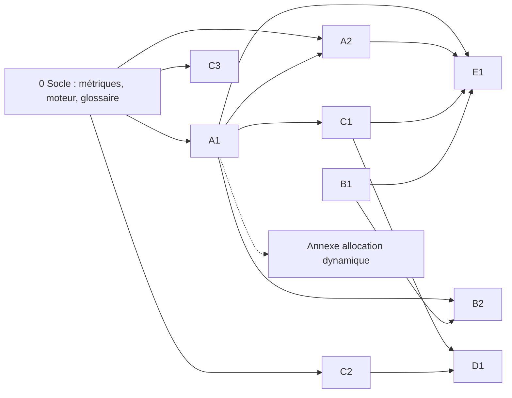

# Audit de la proposition v3 — angle « lacunes » (couverture et architecture)

Date : 2026-10-01. Objet : `proposition-v3.md` (fourmilière et ruche comme chorégraphies sans chorégraphe). Portée : concepts absents, parité fourmi/abeille, équilibre et dépendances des 7 projets, architecture révisée. L'exactitude des références déjà citées dans v3 relève d'autres audits; j'en signale seulement trois que j'ai vérifiées en passant (section 6).

## 1. Verdict

La v3 couvre bien le noyau classique (piste contre danse, seuils, quorum), mais elle manque l'un des deux niveaux annoncés dans l'intention : l'intelligence **individuelle** n'est traitée nulle part. Sa question transversale, la richesse du signal (scalaire → symbole → langage), repose sur une dichotomie que les sources contredisent : le canal n'est pas une propriété du taxon. Les abeilles sans dard tracent des pistes odorantes, les fourmis font du tandem et stridulent, et la phéromone de piste n'est pas qu'un scalaire. Cette question n'a d'ailleurs aucune métrique opérationnelle. Six familles de concepts majeurs manquent : mouvement collectif et transport, auto-assemblage et construction, trophallaxie, signaux vibratoires et modulateurs, effets de taille et types de recrutement, bruit et exploration. La parité est déséquilibrée : une « fourmi » générique tirée de six genres fait face à la seule *Apis mellifera*, et l'écologie n'est pas paramétrée. L'agentique est confinée à P7, sans état de l'art; sa prétention de nouveauté est contredite par des travaux de 2025. Je propose une architecture en cinq axes, avec un socle commun de métriques, trois projets ajoutés, P2 recentré ou mis en annexe, et P6 recentré sur défaillances et défenses.

## 2. Méthode et niveau de preuve

Outils utilisés : WebSearch, jusqu'à épuisement du budget de session; l'outil Consensus, épuisé au premier appel avec le message « You've used all 30 searches this month; resets on November 1st »; puis les API Crossref, OpenAlex, Semantic Scholar, Europe PMC et arXiv, interrogées par WebFetch. Plusieurs pages d'éditeurs (Springer, Science, PNAS, PMC) ont refusé l'accès (403 ou CAPTCHA). Je n'ai contourné aucun contrôle.

Codes de preuve attachés à chaque source :

- **[M]** métadonnées vérifiées dans Crossref ou OpenAlex (titre, auteurs, revue, volume, année);
- **[R]** résumé (abstract) lu par API ou sur la page de l'éditeur;
- **[S]** résumé produit par le moteur de recherche à partir de la page : source secondaire, à relire avant toute citation dans un livrable;
- **[T]** texte intégral ou section lue;
- **[I]** inférence de l'auditeur, non lue dans une source.

Je n'ai lu aucun texte intégral, sauf la section résultats de Schürch et Ratnieks (2015). Les affirmations de contenu marquées [S] restent donc à confirmer à la lecture.

## 3. Constats

Tableau récapitulatif (détails plus bas).

| ID | Gravité | Section visée | Constat en bref |
|---|---|---|---|
| L01 | critique | Intention; tous projets | Intelligence individuelle absente |
| L02 | critique | Tableau; question transversale | Axe « scalaire → symbole → langage » qui confond taxon et canal |
| L03 | critique | Question transversale; P7 | « Gain collectif » et « richesse du signal » non opérationnalisés |
| L04 | majeur | Tous; Technique | Agentique confinée à P7, sans état de l'art ni protocole par projet |
| L05 | majeur | P7 | Nouveauté de P7 contredite par des travaux publiés; coût absent |
| L06 | majeur | Tableau (Freinage); P1 | Rétroaction négative chez les fourmis ignorée |
| L07 | majeur | P1; P7 | Types de recrutement et effets de taille de colonie absents |
| L08 | majeur | P1; P2 | Bruit bénéfique et exploration/exploitation absents |
| L09 | majeur | P1; P5; P7 | Cascades d'information et conformité non nommées |
| L10 | majeur | Nouveau projet | Mouvement collectif et transport coopératif absents |
| L11 | majeur | Nouveau projet | Auto-assemblage et construction stigmergique absents |
| L12 | majeur | P4 | Trophallaxie absente chez les deux espèces |
| L13 | majeur | P5; P4 | Signaux vibratoires et modulateurs, passage à l'acte absents |
| L14 | majeur | Thèse; Tableau | « La reine ne commande pas » : modulation globale non traitée |
| L15 | majeur | P3 | Division du travail de l'abeille réduite au polyéthisme d'âge |
| L16 | majeur | Ensemble | Parité : fourmi générique contre *Apis mellifera*; écologie non paramétrée |
| L17 | majeur | P2 | P2 non comparable et éloigné de la chorégraphie |
| L18 | majeur | P6 | P6 hétérogène (trois moteurs) et sans volet défense |
| L19 | mineur | Tableau (Oubli) | Mémoire collective non thématisée |
| L20 | mineur | P5 | Décision d'essaimer (reproduction) absente |
| L21 | mineur | Thèse | Superorganisme et cognition distribuée non cadrés |
| L22 | mineur | P5 | Aucun modèle de l'inhibition croisée cité |
| L23 | mineur | Tableau (Recrutement) | Analogie « recrutement = délégation » trompeuse |
| L24 | mineur | Parcours | Dépendances non déclarées entre projets |
| L25 | mineur | P3 (Agentique) | Affirmation agentique de P3 sans appui |
| L26 | mineur | P1 (abeilles) | Règle individuelle de choix des sources absente |

### L01 — critique — Intelligence individuelle absente

- **Section visée** : l'intention (« au niveau de l'intelligence individuelle et collective ») et l'ensemble des 7 projets.
- **Problème** : aucun projet ne modélise les capacités de l'individu (navigation, odométrie, apprentissage, mémoire privée) ni la relation individu → colonie. Or c'est précisément le levier du parallèle avec les agents LLM, qui sont des individus « riches ».
- **Preuves** :
  - Feinerman et Korman (2017) distinguent deux sources de la cognition collective : la cognition individuelle et la connectivité [S].
  - Chez *Temnothorax*, la colonie surpasse l'individu quand la discrimination est difficile, mais pas quand elle est facile, où la rétroaction positive peut verrouiller un choix sous-optimal (Sasaki et al. 2013) [S]. La colonie corrige aussi des biais irrationnels de l'individu (Sasaki et Pratt 2011) [S]. Synthèse dans Sasaki et Pratt (2018) [S][M].
  - Beckers et al. (1989), sur 98 espèces, opposent deux plans d'organisation : les petites sociétés misent sur l'apprentissage de leurs membres, les grandes sur des patrons collectifs émergents [R].
  - Capacités individuelles documentées : odomètre à pas de *Cataglyphis* (Wittlinger, Wehner et Wolf 2006) [S]; odomètre par flux optique de l'abeille, que la danse transmet (Esch et al. 2001) [S]; concepts « pareil/différent » chez l'abeille (Giurfa et al. 2001) [S]; une danse correcte exige un apprentissage social (Dong et al. 2023) [S].
  - Conflit entre information privée et sociale, chez l'abeille (Grüter, Balbuena et Farina 2008) [S] comme chez *Lasius niger* (Grüter, Czaczkes et Ratnieks 2011) [S].
- **Recommandation** : ajouter un projet « Individu et colonie » (A2, section 4).
  - Résultats à reproduire : Sasaki et al. 2013 pour les fourmis; pour les abeilles, la valeur de la danse selon l'environnement (I'Anson Price et al. 2019) [S] et les conflits d'information (Grüter et al. 2008).
  - Volet agentique : quand un collectif d'agents faibles bat-il un agent fort seul, et à quelle difficulté de tâche? Mémoire de contexte privée contre état partagé.

### L02 — critique — L'axe « scalaire → symbole → langage » confond taxon et canal

- **Section visée** : le tableau « Deux chorégraphies naturelles » (lignes Canal, Contenu du signal) et la question transversale.
- **Problème** : v3 attribue à la fourmi un canal persistant et un signal scalaire, à l'abeille un canal éphémère et symbolique. Les sources contredisent cette partition.
- **Preuves** :
  - Des abeilles (Meliponini) déposent des pistes odorantes continues du nid à la source; elles sont les seules abeilles connues à le faire, jusqu'à environ 900 m selon le résumé (Nieh 2004) [S].
  - Les fourmis pratiquent le tandem, canal direct, éphémère et bidirectionnel (Franks et Richardson 2006) [S], et la stridulation, recrutement vibratoire à courte portée (Roces, Tautz et Hölldobler 1993) [S].
  - La piste n'est pas qu'un scalaire. La géométrie des bifurcations (environ 60°) encode la polarité (Jackson, Holcombe et Ratnieks 2004) [S]. *Monomorium pharaonis* utiliserait trois phéromones aux durées de vie différentes (Robinson et al. 2005) [S], mais une réplication (thèse USP, 2018) n'a pas retrouvé la phéromone répulsive [S]. Revue intégrative : Czaczkes, Grüter et Ratnieks (2015) [M].
  - Des mesures en bits existent : 2,0 bits pour la direction selon Haldane et Spurway (1954) [M]; 2,9 bits (direction) et 4,5 bits (distance) selon Schürch et Ratnieks (2015) [T]. Ryabko et Reznikova (1996) appliquent Shannon et Kolmogorov aux fourmis [M], résultat que je sais contesté sans l'avoir vérifié [I].
- **Recommandation** :
  1. Reformuler la question transversale autour de propriétés **mesurables** du canal (persistance, localisation, bits par signal, débit, coût d'émission), et non autour du taxon.
  2. Faire du canal une variable indépendante du moteur, avec des contre-factuels (abeille à piste façon Meliponini, fourmi au tandem). Le slogan « le contraste vient du mécanisme » devient alors testable.
  3. Ajouter un encadré « contre-exemples » aux supports de vulgarisation pour éviter l'essentialisme.

### L03 — critique — « Gain collectif » et « richesse du signal » non opérationnalisés

- **Section visée** : la question transversale et P7 (« courbe du gain collectif selon la richesse du signal »).
- **Problème** : aucune des deux grandeurs n'est définie. P7, seul projet présenté comme contribution originale, n'a donc pas de variable dépendante falsifiable [I].
- **Preuves** : Sasaki et al. (2013) mesurent un gain collectif par comparaison colonie/individu isolé sur la même tâche [S]. Schürch et Ratnieks (2015) mesurent l'information spatiale du signal en bits [T].
- **Recommandation** : un socle commun, à fixer avant tout projet :
  - **Gain collectif G** = performance du collectif ÷ performance du meilleur individu isolé, et ÷ celle de N individus indépendants (deux références).
  - **Richesse R** = information mutuelle entre le signal et la cible (bits), mesurée dans le moteur.
  - **Robustesse** = perte de G après retrait ou perturbation de k % des agents ou du canal.
  - **Coût** = messages, tokens, latence.

### L04 — majeur — Agentique confinée à P7, sans état de l'art ni protocole par projet

- **Section visée** : la ligne « Agentique » des projets P1 à P6; la section Technique.
- **Problème** : P1 à P6 ne proposent que des analogies en une ligne, et aucune référence agentique n'est citée. Le terme central, « chorégraphie », vient de l'architecture orientée services et n'est pas défini.
- **Preuves** : définition de référence orchestration/chorégraphie chez Peltz (2003) [M]; stigmergie comme mécanisme universel de coordination (Heylighen 2016, deux articles) [M]; théorie de la coordination (Malone et Crowston 1994) [M]; taxonomie des échecs des systèmes multi-agents LLM (Cemri et al. 2025, NeurIPS) [M]; loi d'échelle logistique de la collaboration multi-agents (Qian et al. 2024) [R]; conformité des LLM à la majorité (Zhu et al. 2024) [R].
- **Recommandation** : donner à chaque projet un volet agentique expérimental. On joue le même scénario avec des agents à règles dans le moteur (et des agents LLM là où c'est pertinent), mesuré avec les métriques de L03. Ajouter au socle un glossaire : orchestration, chorégraphie, stigmergie, modulation (L14).

### L05 — majeur — Nouveauté de P7 contredite; coût absent

- **Section visée** : P7 (« seul projet sans résultat publié à reproduire »).
- **Problème** : des travaux publiés placent déjà des LLM dans des simulations d'essaims.
- **Preuves** :
  - Jimenez-Romero, Yegenoglu et Blum (2025) remplacent les règles d'agents par des prompts GPT-4o dans NetLogo, pour le fourragement de fourmis et le vol en bande [R].
  - Rahman, Schranz et Hayat (2025, révisé en 2026) comparent Boids et ACO classiques à leurs versions LLM; le Boids LLM coûte environ 300 fois plus de temps de calcul [R].
  - SwarmWorld (Pal, Wang et Buehler, août 2026, prépublication) étudie la stigmergie entre agents LLM [R].
- **Recommandation** : remplacer « sans résultat publié » par « reproduit Jimenez-Romero et al. 2025 puis l'étend ». Ajouter le coût comme axe de la grille. Ajouter la taille du collectif (L07), car Beckers et al. (1989) prédisent un compromis entre capacité individuelle et taille [R]. Une remarque de méthode, plutôt que de lacune : les noms de modèles (Haiku, Sonnet, Opus) vieilliront; mieux vaut décrire la capacité par une mesure indépendante du produit [I].

### L06 — majeur — Rétroaction négative chez les fourmis ignorée

- **Section visée** : la ligne Freinage du tableau (« Fourmilière : absence de retours ») et la dichotomie de P1 (piste rigide, danse adaptable).
- **Problème** : v3 présente la fourmi comme dépourvue de frein actif.
- **Preuves** :
  - Chez *Lasius niger*, l'encombrement aux sources crée une rétroaction négative qui garde la colonie flexible et lui permet de se réallouer vers une meilleure source malgré une piste forte (Grüter et al. 2012, PLoS ONE) [R].
  - Le bruit individuel améliore la décision collective en environnement changeant (Dussutour et al. 2009) [S].
  - Phéromone répulsive possible, mais non répliquée (voir L02).
- **Recommandation** : dans P1, reproduire **les deux** régimes chez les fourmis, verrouillage (Goss et al. 1989) et réallocation par encombrement (Grüter et al. 2012). Le contraste piste/danse devient une question de paramètres plutôt que d'espèce. Corriger le tableau.

### L07 — majeur — Types de recrutement et effets de taille de colonie absents

- **Section visée** : P1 et P7.
- **Preuves** :
  - Six stratégies (individuelle, tandem, groupe/masse, masse, piste-tronc, fourmis légionnaires) s'ordonnent selon la taille de colonie sur 98 espèces (Beckers et al. 1989) [R].
  - Chez la fourmi pharaon, transition de phase entre fourragement désordonné et ordonné selon la taille, avec hystérésis (Beekman, Sumpter et Ratnieks 2001) [S].
  - Chez *Temnothorax*, les grandes colonies n'ont pas d'ouvrières plus spécialisées (Dornhaus, Holley et Franks 2009) [M], et la charge de travail varie avec la taille (Dornhaus et al. 2008) [M].
  - Chez l'abeille, seul le nombre d'ouvrières, au-delà d'environ 4 000, déclenche la construction de rayons à mâles (Smith et al. 2014) [R].
  - Côté agents, la performance croît de façon logistique avec leur nombre (Qian et al. 2024) [R].
- **Recommandation** : faire de N (taille du collectif) un curseur de P1, en reproduisant Beekman et al. 2001, et un axe de P7. Présenter dans P1 la gradation des types de recrutement plutôt que le seul couple piste/danse.

### L08 — majeur — Bruit bénéfique et exploration/exploitation absents

- **Section visée** : P1 et P2.
- **Preuves** :
  - Fourmis : erreur probabiliste comme stratégie (Deneubourg, Pasteels et Verhaeghe 1983) [S]; bruit utile en environnement dynamique (Dussutour et al. 2009) [S].
  - Abeilles : l'imprécision de la danse est plus forte pour une source alimentaire (une zone) que pour un site de nid (un point), à distance égale (Weidenmüller et Seeley 1999) [S]. Cette hypothèse de « l'erreur ajustée » est remise en question par Tanner et Visscher (2010) [M]; leur conclusion n'a pas été lue. Selon son titre, Okada et al. (2014) concluent que l'erreur améliore la flexibilité [M].
  - Éclaireuses et recrues : Seeley (1983) [M]; base moléculaire de l'exploration (Liang et al. 2012) [M].
- **Recommandation** : un curseur « bruit » dans P1, avec reproduction de Dussutour et al. 2009 et la danse imprécise en regard. Présenter l'hypothèse de l'erreur ajustée comme **débattue**. Volet agentique : la température d'échantillonnage et la diversité des prompts jouent le rôle du bruit [I].

### L09 — majeur — Cascades d'information et conformité non nommées

- **Section visée** : P1, P5 et P7.
- **Problème** : le verrouillage sur la branche longue est une cascade, mais v3 ne le nomme pas et n'en tire pas le parallèle avec la conformité des LLM.
- **Preuves** : coûts et bénéfices de l'information sociale (Rieucau et Giraldeau 2011) [M]; la rétroaction positive verrouille un choix sous-optimal quand la tâche est facile (Sasaki et al. 2013) [S]; hystérésis chez la fourmi pharaon (Beekman et al. 2001) [S]; les LLM s'alignent sur la majorité (Zhu et al. 2024) [R].
- **Recommandation** : un indicateur « cascade » commun (fraction de décisions copiées malgré une information privée contraire) dans P1, P5 et P7, avec une expérience agentique de conformité.

### L10 — majeur — Mouvement collectif et transport coopératif absents

- **Section visée** : un nouveau projet.
- **Problème** : guider un groupe par une minorité informée, sans chef désigné, est le cas le plus pur de chorégraphie. v3 l'ignore, sauf le moulin de P6, qui exige un moteur de mouvement construit nulle part ailleurs.
- **Preuves** :
  - Fourmis : chez *Paratrechina longicornis*, un conformisme social intermédiaire permet à un seul individu informé de diriger la charge, de façon optimale près d'un point critique (Gelblum et al. 2015) [S]; cadre physique du transport coopératif (Feinerman et al. 2018) [R].
  - Abeilles : moins de 5 % de l'essaim connaît le site; les mesures de vol appuient l'hypothèse des « streakers », éclaireuses rapides orientées vers la cible (Schultz, Passino et Seeley 2008) [R].
  - Théorie de la minorité informée : Couzin et al. (2005) [M].
- **Recommandation** : projet C2 « Mouvement collectif : la minorité informée ». À reproduire : Gelblum et al. 2015 pour les fourmis, Schultz et al. 2008 pour les abeilles. Y rapatrier le moulin de P6. Volet agentique : quelle fraction d'agents informés suffit, et à quel conformisme.

### L11 — majeur — Auto-assemblage et construction stigmergique absents

- **Section visée** : un nouveau projet (ou un module de phase 3).
- **Problème** : la stigmergie de construction, cas d'origine du concept, et l'auto-assemblage d'ouvrières en structures sont absents. v3 ne traite la stigmergie que par la piste.
- **Preuves** :
  - Fourmis : radeaux de *Solenopsis invicta* (Mlot, Tovey et Hu 2011) [S]; ponts vivants d'*Eciton* ajustés selon un compromis coût-bénéfice (Reid et al. 2015) [S]; construction du nid de *Lasius niger* par stigmergie phéromonale et gabarit corporel (Khuong et al. 2016) [S].
  - Abeilles : adaptation mécanique collective de la grappe d'essaim (Peleg et al. 2018, Nature Physics; attention, le premier auteur est Peleg et l'année 2018, pas Peters 2019 comme on le cite parfois) [S]; forme hexagonale des cellules selon le comportement de construction (Nazzi 2016) [M].
  - Agentique : stigmergie (Heylighen 2016) [M]; SwarmWorld 2026 [R].
- **Recommandation** : projet C3 « Construire sans plan », en phase 3. Reproduire Reid et al. 2015 (le compromis coût-bénéfice se transpose directement aux agents) et Peleg et al. 2018. Analogie agentique : des agents qui coordonnent par artefacts partagés (dépôt de code, documents) plutôt que par messages [I].

### L12 — majeur — Trophallaxie absente chez les deux espèces

- **Section visée** : P4.
- **Preuves** :
  - Fourmis : le liquide trophallactique de *Camponotus floridanus* transporte protéines, hydrocarbures, microARN et hormone juvénile (LeBoeuf et al. 2016) [S][M]; réseaux trophallactiques mesurés (Greenwald, Segre et Feinerman 2015 [M]; Planckaert et al. 2019, chez *Lasius niger* [M]).
  - Abeilles : le transfert de nectar aux receveuses, au cœur de P4 (Seeley 1992), est une trophallaxie, mais v3 ne le nomme pas [I]. Je n'ai pas pu vérifier de source primaire sur la trophallaxie comme canal d'information chez l'abeille : à vérifier.
- **Recommandation** : un module « réseau trophallactique » dans P4 pour les deux espèces. Analogie agentique : protocoles de rumeur (gossip) et état partagé propagé par contacts pair à pair [I].

### L13 — majeur — Signaux vibratoires et modulateurs; passage à l'acte absents

- **Section visée** : P5 (et P4).
- **Problème** : v3 retient la trémulation et le signal d'arrêt, mais pas la séquence qui transforme une décision en action collective.
- **Preuves** :
  - Le signal vibratoire (« shaking ») est un signal modulateur de sens général « augmente ton activité » (Schneider et Lewis 2004) [S].
  - Le « piping » des ouvrières prépare l'essaim au décollage (Seeley et Tautz 2001) [S], et le « buzz-run » signale le départ (Rittschof et Seeley 2008) [S].
  - Revue des signaux de l'abeille : Hasenjager, Franks et Leadbeater (2022) [S][M].
  - Fourmis, en parité : stridulation de recrutement (Roces et al. 1993) [S]; passage du tandem au transport après le quorum (Pratt et al. 2002, cité dans v3).
- **Recommandation** : étendre P5 à « de la décision à l'action » (quorum → préparation → départ). Analogie agentique explicite : validation en deux phases (préparer, puis engager) sans coordinateur [I].

### L14 — majeur — « La reine ne commande pas » : la modulation globale n'est pas traitée

- **Section visée** : la thèse et le tableau.
- **Problème** : la thèse est juste, mais incomplète. Il existe un troisième mode, ni orchestration ni chorégraphie pair à pair : la diffusion de signaux chimiques globaux qui modulent des seuils.
- **Preuves** : bases sémiochimiques de la cour de la reine (Slessor et al. 1988) [M]; phéromone d'amorçage des ouvrières qui règle la maturation comportementale (Leoncini et al. 2004) [M]; plasticité régulée par les interactions entre ouvrières (Huang et Robinson 1992) [M].
- **Recommandation** : ajouter au tableau une ligne « Modulation globale » (phéromone royale, phéromone d'amorçage; côté agents, prompt système ou configuration diffusée), et la distinguer de l'orchestration dans le glossaire.

### L15 — majeur — Division du travail de l'abeille réduite au polyéthisme d'âge

- **Section visée** : P3 (volet abeille).
- **Preuves** : la maturation est accélérée ou freinée par les interactions entre ouvrières, via l'oléate d'éthyle (Huang et Robinson 1992; Leoncini et al. 2004) [M]; revue de la division du travail chez l'abeille (Johnson 2009) [M]; perspective évolutive de l'auto-organisation (Duarte et al. 2011) [M]; ouvrières inactives servant de réserve (Charbonneau, Sasaki et Dornhaus 2017) [M]; titre explicite, contenu non lu.
- **Recommandation** : ajouter à P3 l'inhibition sociale, analogue abeille de la régulation par rencontres de Gordon, et une expérience « réserve » : retirer des actifs ou retirer des inactifs. Volet agentique : la capacité de réserve, ou agents oisifs, comme tampon.

### L16 — majeur — Parité : fourmi générique contre *Apis mellifera*; écologie non paramétrée

- **Section visée** : l'ensemble, et la section Technique (« deux espèces interchangeables »).
- **Problème** : les volets fourmis mobilisent six genres (piste de P1, *Pheidole*, *Pogonomyrmex*, *Temnothorax*, *Phengaris*, fourmis légionnaires), les volets abeilles une seule espèce. Le moteur ne prévoit aucun paramètre écologique.
- **Preuves** :
  - Le comportement collectif des fourmis dépend de l'écologie : stabilité, risque de perturbation, distribution des ressources (Gordon 2019) [M][R].
  - Recrutement et taille varient sur 98 espèces (Beckers et al. 1989) [R].
  - Le bénéfice de la danse dépend de la distribution spatio-temporelle des ressources (Dornhaus et Chittka 2004) [M], au point que des colonies privées d'orientation de danse butinent mieux dans des milieux difficiles (I'Anson Price et al. 2019) [S].
  - La danse varie entre espèces d'*Apis* (Beekman et al. 2015) [M]. Les Meliponini ont des pistes (Nieh 2004) [S].
- **Recommandation** : nommer l'espèce modèle de chaque volet. Ajouter au moteur des paramètres d'environnement (dispersion des sources, distance, volatilité, locomotion 2D ou 3D). Inclure, au moins dans P1, un « tiers témoin » (Meliponini) qui casse la dichotomie.

### L17 — majeur — P2 non comparable et éloigné de la chorégraphie

- **Section visée** : P2 (ACO contre ABC).
- **Problème** : ACO sur un TSP (Oliver30) et ABC sur des fonctions continues ne mesurent pas la même chose, et l'optimisation statique ne relève pas de la coordination sans coordinateur [I].
- **Preuves** : il existe une paire comparable, sur la même classe de problème dynamique et distribué : AntNet pour le routage (Di Caro et Dorigo 1998) [M], et l'allocation de serveurs inspirée de l'abeille (Nakrani et Tovey 2004). Ces derniers concluent que l'algorithme abeille bat l'allocation gloutonne quand la charge est très variable, mais pas quand elle l'est peu [R].
- **Recommandation** : recentrer P2 sur l'allocation dynamique distribuée, avec le même flux de requêtes pour les deux mécanismes, ou le reléguer en annexe. Le résultat de Nakrani et Tovey sert directement le volet agentique (répartition de charge entre agents).

### L18 — majeur — P6 hétérogène (trois moteurs) et sans volet défense

- **Section visée** : P6.
- **Problème** : le moulin demande un moteur de mouvement, le mimétisme un modèle de reconnaissance chimique, l'interblocage le moteur de P5. Rien ne traite les défenses collectives, alors que P6 vise l'injection de prompt.
- **Preuves** : chez *Lasius niger*, la plasticité du réseau social réduit la transmission de maladie (Stroeymeyt et al. 2018) [M]; titre explicite, contenu non lu. Résilience des infrastructures des insectes sociaux (Middleton et Latty 2016) [M]. Côté abeille, je n'ai pas vérifié de source sur l'immunité sociale : à vérifier.
- **Recommandation** : P6 devient « Défaillances et défenses ». Il garde l'interblocage et l'intrusion par mimétisme, ajoute la modularité du réseau comme pare-feu (propagation d'une injection dans un graphe d'agents) et cède le moulin à C2.

### L19 — mineur — Mémoire collective non thématisée

- **Section visée** : la ligne Oubli du tableau.
- **Preuves** : l'article cité dans v3 pour la phase tore s'intitule « Collective Memory and Spatial Sorting in Animal Groups » (Couzin et al. 2002) [M], mais le concept n'est pas exploité. Ajouter l'hystérésis de Beekman et al. (2001) [S] et la piste comme mémoire externe (Czaczkes et al. 2015) [M].
- **Recommandation** : remplacer la ligne « Oubli » par « Mémoire » : externe (piste), individuelle (route apprise), d'état du groupe (hystérésis).

### L20 — mineur — Décision d'essaimer (reproduction) absente

- **Section visée** : P5.
- **Preuves** : revue des mécanismes qui règlent l'essaimage (Grozinger, Richards et Mattila 2014) [M]; seuil d'ouvrières déclencheur de l'investissement reproductif (Smith et al. 2014) [R].
- **Recommandation** : la mentionner en prologue de P5 ou la déclarer hors périmètre; elle se modélise moins bien que le choix du site [I].

### L21 — mineur — Superorganisme et cognition distribuée non cadrés

- **Preuves** : Wheeler (1911) [M]; Hölldobler et Wilson (2009), existence vérifiée par deux recensions [M]; Feinerman et Korman (2017) [S]; colonies et cerveaux sous le même cadre de décision optimale (Marshall, Bogacz et Dornhaus 2009) [M]; Sasaki et Pratt (2018) [S].
- **Recommandation** : un chapitre théorique du socle (niveaux d'analyse, limites de l'analogie superorganisme/agents).

### L22 — mineur — Aucun modèle de l'inhibition croisée cité

- **Section visée** : P5 (« l'inhibition croisée débloque une égalité »).
- **Preuves** : un modèle de décision sensible à la valeur (Pais et al. 2013) [M] accompagne le résultat empirique de Seeley et al. (2012) [M].
- **Recommandation** : citer et implémenter ce modèle comme cible de reproduction.

### L23 — mineur — Analogie « recrutement = délégation » trompeuse

- **Section visée** : la ligne Recrutement du tableau.
- **Problème** : la délégation suppose qu'un délégant assigne une tâche, ce qui relève de l'orchestration au sens de Peltz (2003) [M]. Le recrutement est une publicité que le receveur choisit de suivre [I].
- **Recommandation** : « annonce et abonnement (pull) » plutôt que « délégation ».

### L24 — mineur — Dépendances non déclarées entre projets

- **Section visée** : le parcours « 1 → 3 → 5, puis 2, 4, 6, puis 7 ».
- **Problème** [I] : le volet abeille de P4 (receveuses, trémulation) dépend du modèle de butinage de P1, mais P4 vient après P3 et P5. P6 dépend de P5 et d'un moteur de mouvement inexistant. P7 dépend de métriques non définies (L03).
- **Recommandation** : voir le graphe de la section 5.

### L25 — mineur — Affirmation agentique de P3 sans appui

- **Section visée** : P3, volet agentique (« des agents identiques réagissent en même temps et oscillent; la diversité stabilise »).
- **Problème** : aucune source agentique. Kleinberg et Raghavan (2021) traitent la monoculture algorithmique [M], mais sous l'angle du bien-être et non de l'oscillation; le lien est mon inférence [I].
- **Recommandation** : en faire une hypothèse à tester dans P3, non une affirmation.

### L26 — mineur — Règle individuelle de choix des sources absente (abeilles)

- **Section visée** : P1, volet abeille.
- **Preuves** : conflits entre information privée et danse (Grüter et al. 2008) [S]; discussion de l'usage réel de la danse (Grüter et Farina 2009) [M].
- **Recommandation** : rattacher la règle individuelle (suivre, abandonner, revenir à la source connue) à A2.

## 4. Architecture révisée proposée

| Axe | Projet | Statut | Fourmis : résultat à reproduire | Abeilles : résultat à reproduire | Volet agentique |
|---|---|---|---|---|---|
| 0 Socle | Cadre, glossaire, métriques G/R/robustesse/coût, moteur à canal et environnement paramétrables | ajout | — | — | Protocole commun (agents à règles, puis LLM) |
| A Information | A1 Recrutement : canal, taille, bruit (ex-P1) | enrichi | Goss 1989 (v3) + Grüter 2012 + Beekman 2001 + Dussutour 2009 | Seeley 1991 (v3) + I'Anson Price 2019; témoin Meliponini (Nieh 2004) | État partagé ou diffusion; N et bruit comme curseurs; cascade |
| A Information | A2 Individu et colonie | ajout | Sasaki et al. 2013; Sasaki et Pratt 2011 | Grüter et al. 2008; Dong et al. 2023 | Collectif faible contre agent fort selon la difficulté |
| B Allocation | B1 Division du travail (ex-P3) | enrichi | Wilson 1984 (v3); Charbonneau 2017 | Jones 2004 (v3); Huang et Robinson 1992 | Diversité des seuils, réserve |
| B Allocation | B2 Régulation par interactions (ex-P4) | enrichi | Gordon (v3); Greenwald 2015 (trophallaxie) | Seeley 1992 (v3); signal vibratoire (Schneider et Lewis 2004) | Backpressure; gossip |
| C Action | C1 Quorum et passage à l'acte (ex-P5) | enrichi | Pratt 2002 (v3) | Seeley 2012 + Pais 2013; Seeley et Tautz 2001; Rittschof et Seeley 2008 | Consensus puis validation en deux phases |
| C Action | C2 Mouvement collectif : minorité informée | ajout | Gelblum 2015 | Schultz 2008 | Fraction d'informés, conformisme; moulin (ex-P6) |
| C Action | C3 Construire sans plan | ajout (phase 3) | Reid 2015 ou Khuong 2016 | Peleg 2018 | Coordination par artefacts partagés |
| D Défaillances | D1 Défaillances et défenses (ex-P6) | recentré | Stroeymeyt 2018; mimétisme | Interblocage sans signal d'arrêt; intrusion | Injection, modularité comme pare-feu |
| E Synthèse | E1 Agents LLM (ex-P7) | recadré | — | — | Architecture × capacité × N × coût; reproduit d'abord Jimenez-Romero 2025 |
| Annexe | Allocation dynamique (ex-P2) | recentré ou retiré | AntNet (Di Caro et Dorigo 1998) | Nakrani et Tovey 2004 | Répartition de charge entre agents |

Justification de l'ensemble : chaque projet a désormais un résultat publié par espèce, ce qui rétablit la parité (L16). Le niveau individuel est couvert (L01). Les métriques partagées rendent E1 falsifiable (L03). Les trois ajouts (A2, C2, C3) correspondent aux familles de concepts les mieux documentées parmi les absentes (L10, L11). La table compte 9 projets plus le socle et l'annexe : c'est plus que v3, d'où le phasage ci-dessous.

## 5. Dépendances et parcours

Phasage proposé [I] :

- **Phase 1** : 0, A1, A2, C1. Le noyau répond à la thèse et à l'intention individuel/collectif.
- **Phase 2** : B1, B2, C2, D1.
- **Phase 3** : E1, C3, annexe.

E1 n'attend que A1, A2, B1 et C1 : on peut l'avancer en fin de phase 2 si le volet agentique est prioritaire.

## 6. Références de v3 vérifiées en passant (hors périmètre principal)

- Franks, Pratt, Mallon, Britton et Sumpter 2002, *Phil. Trans. R. Soc. B* 357:1567–1583 [M][R] : compare bien l'abeille et *Leptothorax* (aujourd'hui *Temnothorax*) *albipennis*. Conforme à v3.
- Couzin, Krause, James, Ruxton et Franks 2002, *J. Theor. Biol.* 218:1–11 [M] : titre exact « Collective Memory and Spatial Sorting in Animal Groups » (voir L19).
- Seeley, Visscher, Schlegel, Hogan, Franks et Marshall 2012, *Science* 335:108–111 [M] : conforme.

## 7. Sources consultées

Format : auteurs, année, titre, revue, DOI ou URL, code de preuve.

**Fourmis**
- Beckers, Goss, Deneubourg, Pasteels 1989. Colony size, communication and ant foraging strategy. *Psyche* 96:239–256. https://doi.org/10.1155/1989/94279 [M][R]
- Beekman, Sumpter, Ratnieks 2001. Phase transition between disordered and ordered foraging in Pharaoh's ants. *PNAS* 98:9703–9706. https://www.pnas.org/doi/10.1073/pnas.161285298 [S]
- Charbonneau, Sasaki, Dornhaus 2017. Who needs "lazy" workers? *PLoS ONE* 12:e0184074. https://doi.org/10.1371/journal.pone.0184074 [M]
- Czaczkes, Grüter, Ratnieks 2015. Trail pheromones: an integrative view… *Annu. Rev. Entomol.* 60:581–599. https://doi.org/10.1146/annurev-ento-010814-020627 [M]
- Deneubourg, Pasteels, Verhaeghe 1983. Probabilistic behaviour in ants: a strategy of errors? *J. Theor. Biol.* 105:259–271. [S]
- Dornhaus, Holley, Pook, Worswick, Franks 2008. Why do not all workers work? *Behav. Ecol. Sociobiol.* https://doi.org/10.1007/s00265-008-0634-0 [M]
- Dornhaus, Holley, Franks 2009. Larger colonies do not have more specialized workers… *Behav. Ecol.* https://doi.org/10.1093/beheco/arp070 [M]
- Dussutour, Beekman, Nicolis, Meyer 2009. Noise improves collective decision-making by ants in dynamic environments. *Proc. R. Soc. B* 276:4353–4361. https://research.monash.edu/en/publications/noise-improves-collective-decision-making-by-ants-in-dynamic-envi/ [S]
- Feinerman, Pinkoviezky, Gelblum, Fonio, Gov 2018. The physics of cooperative transport in groups of ants. *Nature Physics*. https://doi.org/10.1038/s41567-018-0107-y [M][R]
- Franks, Richardson 2006. Teaching in tandem-running ants. *Nature* 439:153. https://www.nature.com/articles/439153a [S]
- Gelblum et al. 2015. Ant groups optimally amplify the effect of transiently informed individuals. *Nat. Commun.* 6:7729. https://www.nature.com/articles/ncomms8729 [S]
- Gordon 1996. The organization of work in social insect colonies. *Nature* 380:121–124. https://doi.org/10.1038/380121a0 [M]
- Gordon 2019. The ecology of collective behavior in ants. *Annu. Rev. Entomol.* 64:35–50. https://doi.org/10.1146/annurev-ento-011118-111923 [M][R]
- Greenwald, Segre, Feinerman 2015. Ant trophallactic networks… *Sci. Rep.* 5. https://doi.org/10.1038/srep12496 [M]
- Grüter, Czaczkes, Ratnieks 2011. Decision making in ant foragers (*Lasius niger*) facing conflicting private and social information. *Behav. Ecol. Sociobiol.* 65:141–148. [S]
- Grüter, Schürch, Czaczkes, Taylor, Durance, Jones, Ratnieks 2012. Negative feedback enables fast and flexible collective decision-making in ants. *PLoS ONE*. https://doi.org/10.1371/journal.pone.0044501 [R]
- Jackson, Holcombe, Ratnieks 2004. Trail geometry gives polarity to ant foraging networks. *Nature* 432:907–909. https://www.nature.com/articles/nature03105 [S]
- Khuong et al. 2016. Stigmergic construction and topochemical information shape ant nest architecture. *PNAS* 113:1303–1308. https://pubmed.ncbi.nlm.nih.gov/26787857/ [S]
- LeBoeuf et al. 2016. Oral transfer of chemical cues, growth proteins and hormones in social insects. *eLife*. https://elifesciences.org/articles/20375 [S][M]
- Mlot, Tovey, Hu 2011. Fire ants self-assemble into waterproof rafts to survive floods. *PNAS* 108:7669. https://pubmed.ncbi.nlm.nih.gov/21518911/ [S]
- Planckaert et al. 2019. A spatiotemporal analysis of the food dissemination process and the trophallactic network in the ant *Lasius niger*. *Sci. Rep.* https://doi.org/10.1038/s41598-019-52019-6 [M]
- Reid et al. 2015. Army ants dynamically adjust living bridges in response to a cost–benefit trade-off. *PNAS* 112:15113–15118. https://researchers.mq.edu.au/en/publications/army-ants-dynamically-adjust-living-bridges-in-response-to-a-cost/ [S]
- Robinson, Jackson, Holcombe, Ratnieks 2005. "No entry" signal in ant foraging. *Nature* 438:442. https://pure.york.ac.uk/portal/en/publications/insect-communication-no-entry-signal-in-ant-foraging [S]
- Réplication non concluante (thèse USP, 2018). Feromônio "No entry" em *Monomorium pharaonis* : réplica experimental. https://www.teses.usp.br/teses/disponiveis/47/47132/tde-05022018-154127/ [S]
- Roces, Tautz, Hölldobler 1993. Stridulation in leaf-cutting ants. *Naturwissenschaften* 80:521–524. https://link.springer.com/article/10.1007/BF01140810 [S]
- Ryabko, Reznikova 1996. Using Shannon entropy and Kolmogorov complexity to study the communicative system and cognitive capacities in ants. *Complexity* 2:37–42. [M]
- Sasaki, Pratt 2011. Emergence of group rationality from irrational individuals. *Behav. Ecol.* 22:276–281. [S]
- Sasaki, Granovskiy, Mann, Sumpter, Pratt 2013. Ant colonies outperform individuals when a sensory discrimination task is difficult but not when it is easy. *PNAS* 110:13769–13773. https://www.pnas.org/doi/10.1073/pnas.1304917110 [S]
- Stroeymeyt et al. 2018. Social network plasticity decreases disease transmission in a eusocial insect. *Science* 362:941–945. https://doi.org/10.1126/science.aat4793 [M]
- Wheeler 1911. The ant-colony as an organism. *J. Morphol.* 22:307–325. https://doi.org/10.1002/jmor.1050220206 [M]
- Wittlinger, Wehner, Wolf 2006. The ant odometer: stepping on stilts and stumps. *Science* 312:1965–1967. https://www.science.org/doi/10.1126/science.1126912 [S]

**Abeilles**
- Beekman et al. 2015. Honeybee linguistics — a comparative analysis of the waggle dance among species of *Apis*. *Front. Ecol. Evol.* https://doi.org/10.3389/fevo.2015.00011 [M]
- Dong, Lin, Nieh, Tan 2023. Social signal learning of the waggle dance in honey bees. *Science* 379. https://www.science.org/doi/10.1126/science.ade1702 [S]
- Dornhaus, Chittka 2004. Why do honey bees dance? *Behav. Ecol. Sociobiol.* 55:395–401. https://doi.org/10.1007/s00265-003-0726-9 [M]
- Esch, Zhang, Srinivasan, Tautz 2001. Honeybee dances communicate distances measured by optic flow. *Nature* 411:581–583. [S]
- Giurfa, Zhang, Jenett, Menzel, Srinivasan 2001. The concepts of "sameness" and "difference" in an insect. *Nature* 410:930–933. [S]
- Grozinger, Richards, Mattila 2014. From molecules to societies: mechanisms regulating swarming behavior in honey bees. *Apidologie* 45:327–346. https://link.springer.com/article/10.1007/s13592-013-0253-2 [M]
- Grüter, Balbuena, Farina 2008. Informational conflicts created by the waggle dance. *Proc. R. Soc. B* 275:1321–1327. [S]
- Grüter, Farina 2009. The honeybee waggle dance: can we follow the steps? *TREE* 24:242–247. https://doi.org/10.1016/j.tree.2008.12.007 [M]
- Haldane, Spurway 1954. A statistical analysis of communication in *Apis mellifera*… *Insectes Sociaux* 1:247–283. https://doi.org/10.1007/BF02222949 [M]
- Hasenjager, Franks, Leadbeater 2022. From dyads to collectives: a review of honeybee signalling. *Behav. Ecol. Sociobiol.* https://doi.org/10.1007/s00265-022-03218-1 [S][M]
- Huang, Robinson 1992. Honeybee colony integration… *PNAS* 89:11726–11729. https://doi.org/10.1073/pnas.89.24.11726 [M]
- I'Anson Price et al. 2019. Honeybees forage more successfully without the "dance language" in challenging environments. *Sci. Adv.* 5:eaat0450. https://www.science.org/doi/10.1126/sciadv.aat0450 [S]
- Johnson 2009. Division of labor in honeybees: form, function, and proximate mechanisms. *Behav. Ecol. Sociobiol.* https://doi.org/10.1007/s00265-009-0874-7 [M]
- Leoncini et al. 2004. Regulation of behavioral maturation by a primer pheromone produced by adult worker honey bees. *PNAS* 101:17559–17564. https://doi.org/10.1073/pnas.0407652101 [M]
- Liang et al. 2012. Molecular determinants of scouting behavior in honey bees. *Science* 335:1225–1228. https://doi.org/10.1126/science.1213962 [M]
- Nazzi 2016. The hexagonal shape of the honeycomb cells depends on the construction behavior of bees. *Sci. Rep.* 6. https://doi.org/10.1038/srep28341 [M]
- Nieh 2004. Recruitment communication in stingless bees. *Apidologie* 35:159–182. https://www.apidologie.org/articles/apido/abs/2004/02/M4207/M4207.html [S]
- Okada et al. 2014. Error in the honeybee waggle dance improves foraging flexibility. *Sci. Rep.* 4:4175. https://pubmed.ncbi.nlm.nih.gov/24569525/ [M]
- Peleg, Peters, Salcedo, Mahadevan 2018. Collective mechanical adaptation of honeybee swarms. *Nature Physics*. https://www.nature.com/articles/s41567-018-0262-1 [S]
- Rittschof, Seeley 2008. The buzz-run: how honeybees signal "Time to go!". *Anim. Behav.* 75:189–197. [S]
- Schneider, Lewis 2004. The vibration signal, modulatory communication and the organization of labor in honey bees. *Apidologie* 35:117–131. [S]
- Schultz, Passino, Seeley 2008. The mechanism of flight guidance in honeybee swarms: subtle guides or streaker bees? *J. Exp. Biol.* 211:3287–3295. https://doi.org/10.1242/jeb.018994 [M][R]
- Schürch, Ratnieks 2015. The spatial information content of the honey bee waggle dance. *Front. Ecol. Evol.* 3. https://www.frontiersin.org/articles/10.3389/fevo.2015.00022/full [T]
- Seeley 1983. Division of labor between scouts and recruits in honeybee foraging. *Behav. Ecol. Sociobiol.* 12:253–259. https://doi.org/10.1007/BF00290778 [M]
- Seeley, Tautz 2001. Worker piping in honey bee swarms and its role in preparing for liftoff. *J. Comp. Physiol. A* 187:667–676. [S]
- Slessor, Kaminski, King, Borden, Winston 1988. Semiochemical basis of the retinue response to queen honey bees. *Nature* 332:354–356. https://doi.org/10.1038/332354a0 [M]
- Smith, Ostwald, Loftus, Seeley 2014. A critical number of workers in a honeybee colony triggers investment in reproduction. *Naturwissenschaften* 101:783–790. https://doi.org/10.1007/s00114-014-1215-x [R]
- Tanner, Visscher 2010. Does imprecision in the waggle dance fit patterns predicted by the tuned-error hypothesis? *J. Insect Behav.* 23:180–188. https://doi.org/10.1007/s10905-010-9204-1 [M]
- Weidenmüller, Seeley 1999. Imprecision in waggle dances of the honeybee for nearby food sources: error or adaptation? *Behav. Ecol. Sociobiol.* 46:190–199. https://link.springer.com/article/10.1007/s002650050609 [S]

**Transversal et théorie**
- Couzin, Krause, Franks, Levin 2005. Effective leadership and decision-making in animal groups on the move. *Nature* 433:513–516. https://doi.org/10.1038/nature03236 [M]
- Duarte, Weissing, Pen, Keller 2011. An evolutionary perspective on self-organized division of labor in social insects. *Annu. Rev. Ecol. Evol. Syst.* https://doi.org/10.1146/annurev-ecolsys-102710-145017 [M]
- Feinerman, Korman 2017. Individual versus collective cognition in social insects. *J. Exp. Biol.* 220:73–82. https://doi.org/10.1242/jeb.143891 [S]
- Hölldobler, Wilson 2009. *The Superorganism.* Norton; existence vérifiée par recension : https://doi.org/10.1111/j.1525-142x.2009.00382.x [M]
- Marshall, Bogacz, Dornhaus et al. 2009. On optimal decision-making in brains and social insect colonies. *J. R. Soc. Interface*. https://doi.org/10.1098/rsif.2008.0511 [M]
- Middleton, Latty 2016. Resilience in social insect infrastructure systems. *J. R. Soc. Interface* 13. https://doi.org/10.1098/rsif.2015.1022 [M]
- Pais et al. 2013. A mechanism for value-sensitive decision-making. *PLoS ONE* 8:e73216. https://doi.org/10.1371/journal.pone.0073216 [M]
- Rieucau, Giraldeau 2011. Exploring the costs and benefits of social information use… *Phil. Trans. R. Soc. B* 366:949–957. https://doi.org/10.1098/rstb.2010.0325 [M]
- Sasaki, Pratt 2018. The psychology of superorganisms: collective decision making by insect societies. *Annu. Rev. Entomol.* 63:259–275. https://doi.org/10.1146/annurev-ento-020117-043249 [S][M]

**Agentique et systèmes**
- Cemri et al. 2025. Why do multi-agent LLM systems fail? NeurIPS 38. https://doi.org/10.52202/085713-4082 [M]
- Di Caro, Dorigo 1998. AntNet: distributed stigmergetic control for communications networks. *JAIR*. https://doi.org/10.1613/jair.530 [M]
- Heylighen 2016. Stigmergy as a universal coordination mechanism I et II. *Cogn. Syst. Res.* 38:4–13 et 50–59. https://doi.org/10.1016/j.cogsys.2015.12.002 [M]
- Jimenez-Romero, Yegenoglu, Blum 2025. Multi-agent systems powered by large language models: applications in swarm intelligence. arXiv:2503.03800. https://arxiv.org/abs/2503.03800 [R]
- Kleinberg, Raghavan 2021. Algorithmic monoculture and social welfare. *PNAS* 118. https://doi.org/10.1073/pnas.2018340118 [M]
- Malone, Crowston 1994. The interdisciplinary study of coordination. *ACM Comput. Surv.* https://doi.org/10.1145/174666.174668 [M]
- Nakrani, Tovey 2004. On honey bees and dynamic server allocation in Internet hosting centers. *Adaptive Behavior* 12. https://doi.org/10.1177/105971230401200308 [M][R]
- Pal, Wang, Buehler 2026. SwarmWorld: stigmergic technological evolution in societies of language-model agents. arXiv:2608.26081 (prépublication). [R]
- Peltz 2003. Web services orchestration and choreography. *Computer* 36:46–52. https://doi.org/10.1109/MC.2003.1236471 [M]
- Qian et al. 2024. Scaling large language model-based multi-agent collaboration. arXiv:2406.07155. [R]
- Rahman, Schranz, Hayat 2025 (révisé en 2026). LLM-powered swarms: a new frontier or a conceptual stretch? arXiv:2506.14496. https://arxiv.org/abs/2506.14496 [R]
- Zhu, Zhang, Stafford, Collier 2024. Conformity in large language models. arXiv:2410.12428. [R]

**Non vérifiées : à confirmer avant usage.** Trophallaxie comme canal d'information chez l'abeille (Farina et collègues); immunité sociale de l'abeille (« fièvre sociale »); fission de colonie chez les fourmis; Seeley et Buhrman 2001; Couzin 2009 (TICS); McCreery et Breed 2014; Mersch et al. 2013; Hasegawa et al. 2016; Beekman, Fathke et Seeley 2006.
