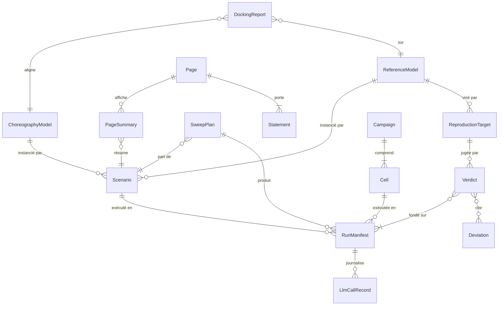

# Modèle d'entités

Vocabulaire du logiciel. Le **nom canonique** de chaque entité est son identifiant de code (`Scenario`, `RunManifest`…) : les cas d'utilisation, le code et les tests l'emploient tel quel. Ce modèle fixe les entités, leurs relations et leurs règles de validation observables; le contrat TypeScript complet de chaque champ est dans [05-spec-simulation.md](../docs/05-spec-simulation.md) §5, qui fait foi pour la forme des données. Le vocabulaire scientifique (stigmergie, quorum, chorégraphie…) est dans le [glossaire](../docs/10-glossaire.md).

## Contexte SIM

### Modèle de référence (`ReferenceModel`)
Réimplantation fidèle d'un modèle publié, dans sa forme publiée (EDO, Monte Carlo, SSA, agents, métaheuristique). Un modèle par article.

| Attribut | Type | Règles de validation |
|---|---|---|
| id | chaîne | requis, unique, forme `<projet>-<auteur>-<année>`, suivie de `-<variante>` quand un article donne plusieurs formes de modèle (p. ex. `p1-goss-1989`, `p5-seeley-2012-ssa`) |
| article | chaîne | requis; étiquette présente dans la [bibliographie](../docs/11-bibliographie.md) |
| type | énuméré | EDO, EDS, MC, SSA, PTD, DES, AGT, META, FERMÉ (05 §3.1) |
| taxon | chaîne | requis pour un modèle biologique; taxon nommé du cadre §2.3 |
| updateOrder | énuméré | `synchronous`, `sequential-random`, `sequential-fixed`; requis pour un modèle à agents |

### Modèle chorégraphique (`ChoreographyModel`)
Modèle commun de la couche 3 : agents, environnement et un **canal** interchangeable (`ChannelConfig` : persistance, portée, adressage, format). Seul le canal change d'une configuration à l'autre.

| Attribut | Type | Règles de validation |
|---|---|---|
| channel.type | énuméré | `field`, `dance-floor`, `blackboard`, `messages` |
| channel.persistence | demi-vie, TTL ou `none` | durée > 0 si présente |
| channel.reach | rayon ou `global` | rayon > 0 si présent |
| channel.addressing | énuméré | `broadcast`, `directed` |
| channel.format | énuméré + bits nominaux | `scalar`, `tuple`, `text`; `maxChars` requis pour `text` |
| openFor | liste d'identifiants de `ReferenceModel` | une référence n'y figure qu'après un `DockingReport` réussi (C-005) |

### Scénario (`Scenario`)
Tout ce qu'il faut pour exécuter et rejouer : modèle, temps, ordre de mise à jour, graine, paramètres, état initial, mesures, interventions. Une fois compilé, il porte ses constantes dérivées et son hachage.

| Attribut | Type | Règles de validation |
|---|---|---|
| regime | énuméré | `confirmatory` ou `exploratory`; `confirmatory` refuse tout paramètre `to-confirm` (C-006) |
| model | référence | identifiant d'un `ReferenceModel` ou d'un `ChoreographyModel` existant |
| time | unité, `dt`, horizon, échantillonnage | `dt` > 0; horizon multiple de `dt`; unité parmi `s`, `min`, `h`, `cycle`, `evaluation` |
| seed | chaîne décimale | requis; entier de 0 à 2⁶⁴ − 1 |
| parameters | par paramètre : valeur, unité, source, statut | source = étiquette et emplacement; statut `published`, `estimated` ou `to-confirm` |
| interventions | liste datée | triée par temps de simulation, dans l'horizon |
| hash | chaîne hexadécimale | 16 caractères; calculé à la compilation, sur le JSON canonique |

### Manifeste d'exécution (`RunManifest`)
Trace de provenance d'une exécution : une exécution produit exactement un manifeste. Manifeste et graine suffisent à rejouer un modèle déterministe.

| Attribut | Type | Règles de validation |
|---|---|---|
| runId | chaîne | requis; dérivé du hachage du scénario, de la graine et du commit |
| regime | énuméré | celui du scénario |
| code | commit, arbre propre, versions | requis; `cleanTree` faux interdit pour une exécution confirmatoire |
| prng | algorithme, graine maîtresse, état initial des flux | requis |
| engine | `node`, `browser` ou `worker`; version; plateforme; architecture | requis |
| outputs | par fichier : nom, format, SHA-256, colonnes avec unités | chaque fichier listé existe et a ce SHA-256 |
| fingerprints | (temps, FNV-1a 64) | au moins une empreinte, au dernier instant échantillonné |
| missing | (grandeur, cause) | toute valeur manquante y figure; aucune `NaN` dans les sorties |
| verdict, deviations | références | présents pour une exécution de cible |

### Cible de reproduction (`ReproductionTarget`)
Extrait exécutable d'une fiche de reproduction ([04](../docs/04-protocole-reproduction.md)) : une cible `T<projet>.<n>` d'une fiche de projet, un fichier `targets/<projet>/T<projet>.<n>.json`.

| Attribut | Type | Règles de validation |
|---|---|---|
| id | chaîne | forme `T<projet>.<n>`; défini dans une fiche de `projets/` |
| state | énuméré | `blocked`, `provisional`, `frozen` |
| level | énuméré | `identity`, `relational`, `distributional` |
| margin | δ et échelle | requise pour `distributional`; fixée avant toute exécution |
| repetitions, maxRepetitions | entiers | `repetitions` ≥ n requis par la marge (garde de puissance) |
| seeds | graine maîtresse, appariement | gelées avant la première exécution |
| scenario | chemin d'un scénario | requis sauf pour une cible `blocked`, sur la cible ou sur chaque critère (une condition par scénario); désigne le modèle visé |
| criteria | liste de critères (grandeur, statistique, test, valeur, marge) | non vide sauf pour une cible `blocked`; conjonctifs; tests `equal`, `TOST`, `range` |

### Verdict (`Verdict`)
Issue d'une cible : `satisfied`, `unsatisfied` ou `inconclusive`; « sous réserve » si la cible était provisoire.

| Attribut | Type | Règles de validation |
|---|---|---|
| outcome | énuméré | une des trois issues |
| provisional | booléen | vrai si la cible était `provisional` |
| measured, mcStandardError, n | nombres | n = nombre d'exécutions réellement faites |
| criteria | issue, valeur mesurée, ES de Monte Carlo par critère | un par critère de la cible |
| deviations | identifiants de `Deviation` | chacun existe au registre |

### Déviation (`Deviation`)
Entrée du registre des déviations du protocole de reproduction.

| Attribut | Type | Règles de validation |
|---|---|---|
| id | chaîne | forme `D-<projet>-<nnn>`; jamais réutilisé |
| type | énuméré | catégories du registre ([04](../docs/04-protocole-reproduction.md)) |

### Plan de balayage (`SweepPlan`)
Produit cartésien d'axes de paramètres, répétitions et observables, à partir d'un scénario de base.

| Attribut | Type | Règles de validation |
|---|---|---|
| axes | (paramètre, valeurs, sens) | paramètre connu du scénario; valeurs dans ses bornes |
| repetitions | entier | > 0 |
| pairing | énuméré | `by-repetition` ou `by-cell` |
| carryState | booléen | vrai seulement pour un balayage d'hystérésis |

### Rapport de docking (`DockingReport`)
Comparaison du modèle chorégraphique, configuré comme la référence, à cette référence : observables, niveau d'accord, marge, n, verdict.

| Attribut | Type | Règles de validation |
|---|---|---|
| reference | identifiant de `ReferenceModel` | sa cible principale est `satisfied` |
| observables, level, margin | déclarés avant les exécutions | marge requise pour `distributional` |
| outcome | énuméré | `aligned` ou `not-aligned` |

### Métriques (`R`, `G`)
Calculées par `src/analysis/` sur des résultats : **R** est un vecteur (nominal, information effective, persistance, portée, adressage), jamais un scalaire; **G** est accompagné de la différence appariée Δ et vaut « indéfini » quand P_max − P_ref est sous le seuil du plan de recherche ([06](../docs/06-metriques-et-typologie.md)).

## Contexte PAGES

### Résumé de page (`PageSummary`)
Résultats précalculés d'un scénario sur N graines, lus par une page (05 §8.3).

| Attribut | Type | Règles de validation |
|---|---|---|
| scenarioHash | chaîne | hachage d'un scénario compilé |
| preregisteredN | entier | > 0; N affiché par la page |
| replaySeed | chaîne décimale | choisie une fois avant publication, par la règle consignée (médiane) |
| cells | (paramètres, n, moyenne, erreur-type, IC 95 %) | une cellule par point du balayage |

### Page (`Page`)
Page statique d'un projet, à trois niveaux.

| Attribut | Type | Règles de validation |
|---|---|---|
| id | chaîne | unique; lié à un projet (`S0`, `P1`…) |
| audience | énuméré | public principal : grand public, étudiants, praticiens, chercheurs |
| levels | sous-ensemble ordonné | `voir`, `explorer`, `verifier` |
| state | fragment d'URL | clés de la liste blanche du manifeste seulement (07 §4.9) |

### Énoncé (`Statement`)
Bloc de texte ou figure d'une page.

| Attribut | Type | Règles de validation |
|---|---|---|
| status | énuméré | liste fermée du cadre (principe 7) : reproduit, publié non reproduit, simplifié, hypothèse, analogie |
| regime | énuméré | `confirmatoire` ou `exploratoire` |
| target | identifiant `T<projet>.<n>` | requis si le statut est « reproduit »; la cible a un verdict `satisfied` |

## Contexte LLM

### Campagne (`Campaign`)
Ensemble de cellules exécutées selon un plan préenregistré, sous un budget plafonné par bras.

| Attribut | Type | Règles de validation |
|---|---|---|
| id | chaîne | unique |
| preregistration | référence | horodatage antérieur à la première exécution confirmatoire |
| budget | montant par bras, en $ US | > 0; jamais dépassé (FR-021) |
| window | dates de début et de fin | consignées dans le manifeste de campagne |

### Cellule (`Cell`)
Combinaison architecture × modèle × scénario × format de canal, avec ses répétitions.

| Attribut | Type | Règles de validation |
|---|---|---|
| architecture | énuméré | indépendants avec vote, orchestrateur témoin, chorégraphie spécifiée, émergente persistante, émergente par diffusion |
| model | identifiant de modèle LLM | revérifié le jour de l'exécution (C-009) |
| effort, maxTokens | valeurs | fixés et consignés |
| repetitions | entier | ≥ celui du plan préenregistré |

### Appel LLM (`LlmCallRecord`)
Une ligne de journal JSONL par appel d'API (champs de 05 §8.6). Les appels d'une exécution forment sa **cassette**, clé de rejeu (`runId`, `step`, `agentId`, `requestHash`).

| Attribut | Type | Règles de validation |
|---|---|---|
| requestedModel, responseModel | chaînes | les deux consignés; un écart est visible |
| requestHash | SHA-256 | du JSON canonique de la requête |
| usage, costUsd | nombres | requis |
| request, response | corps complets | aucun secret |
